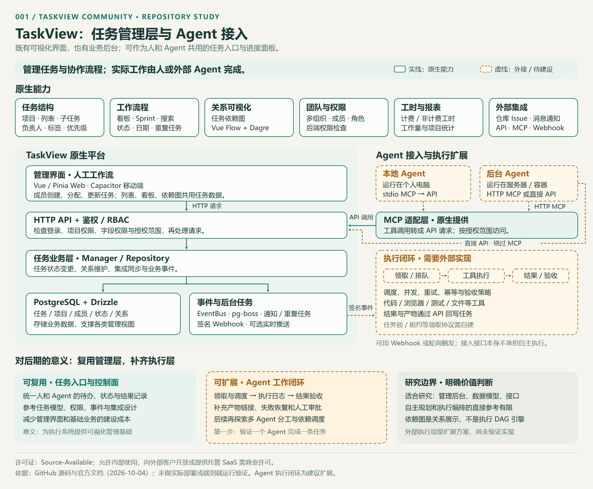
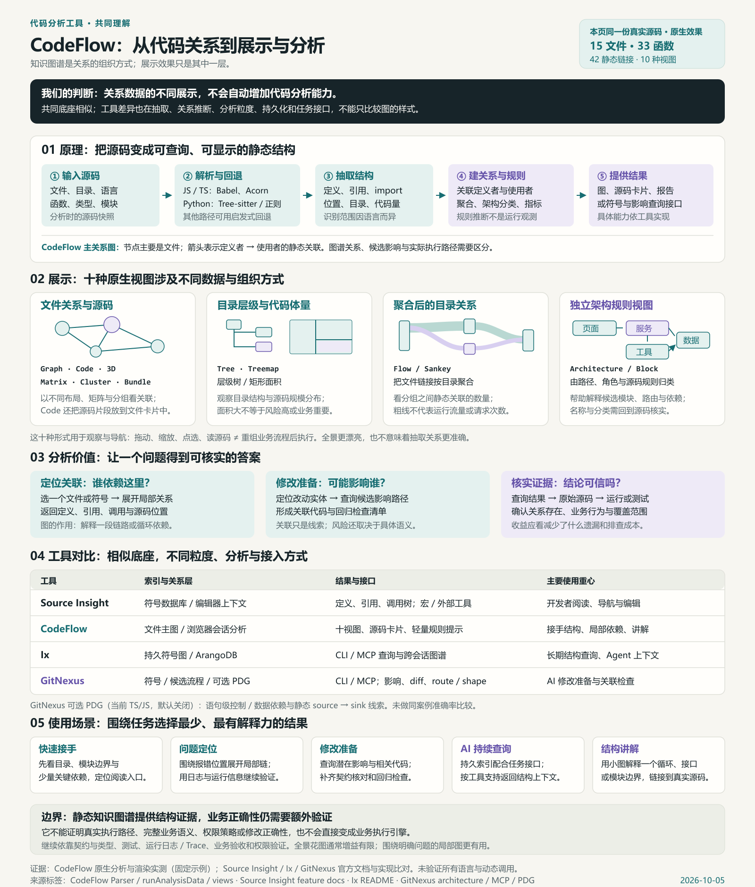
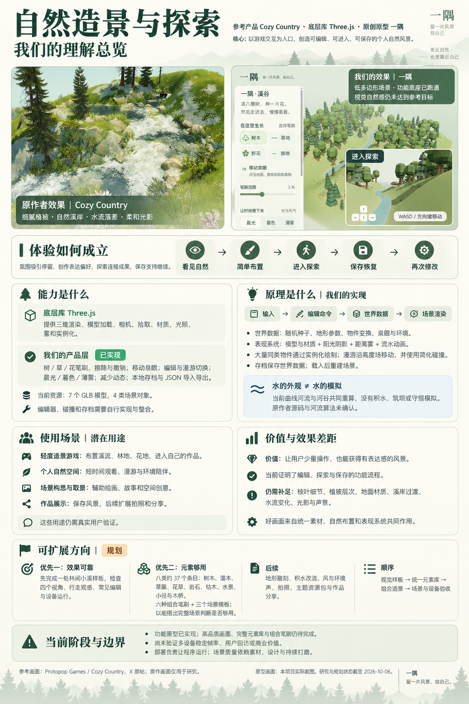
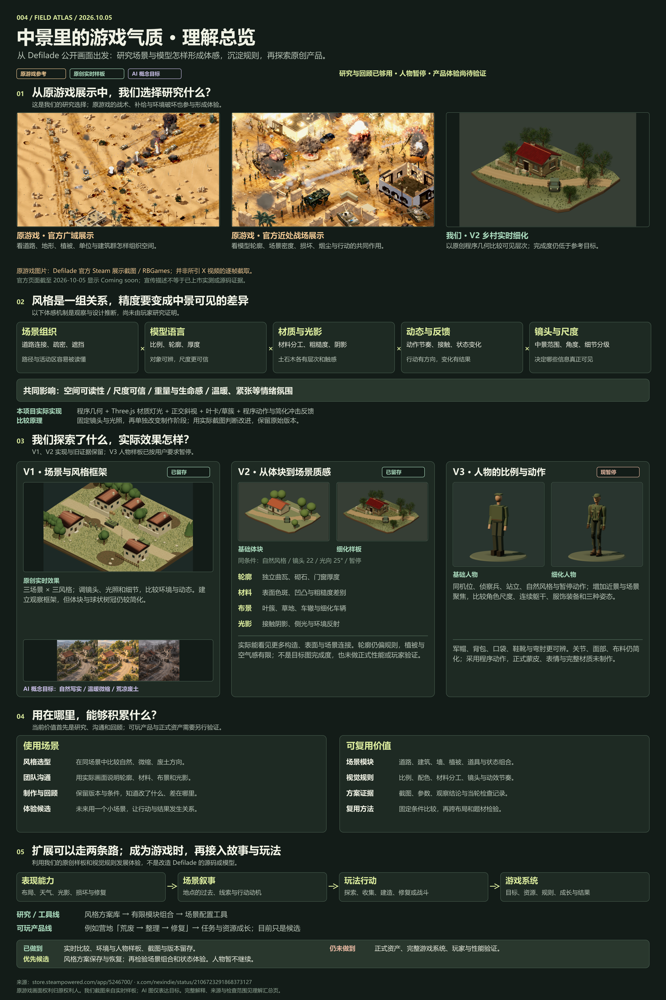
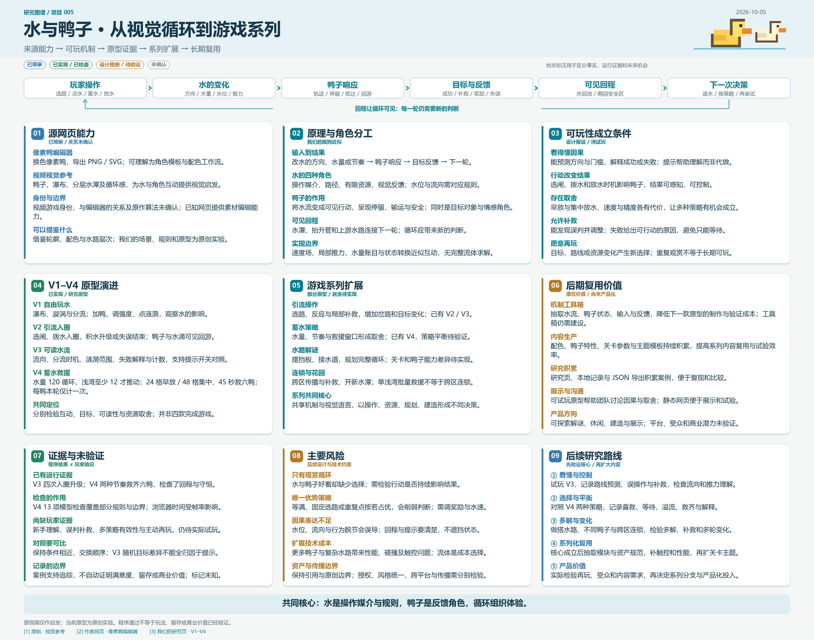
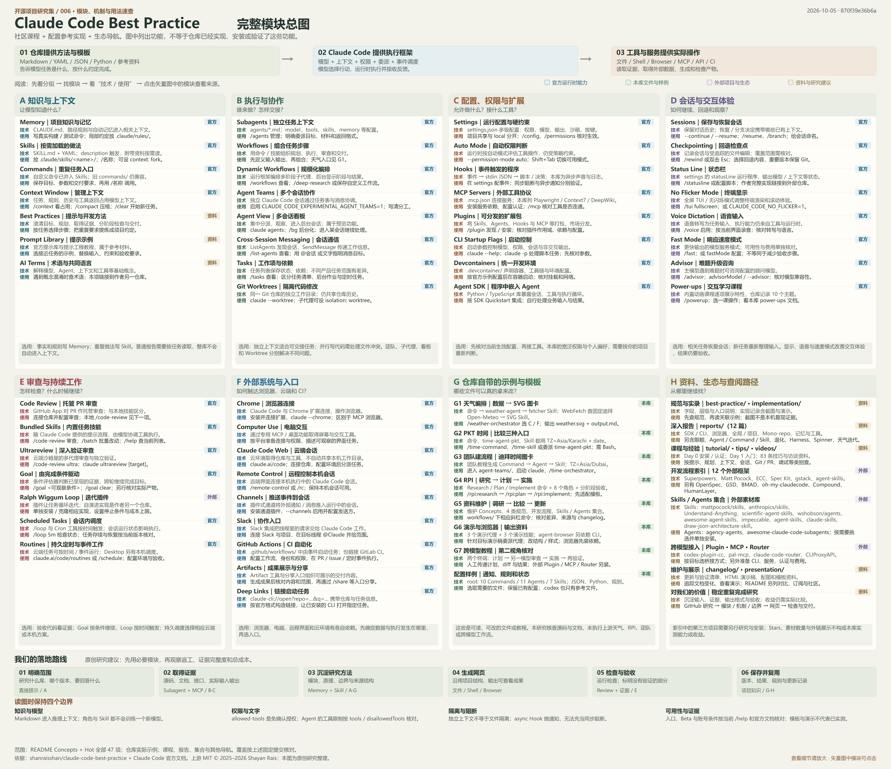
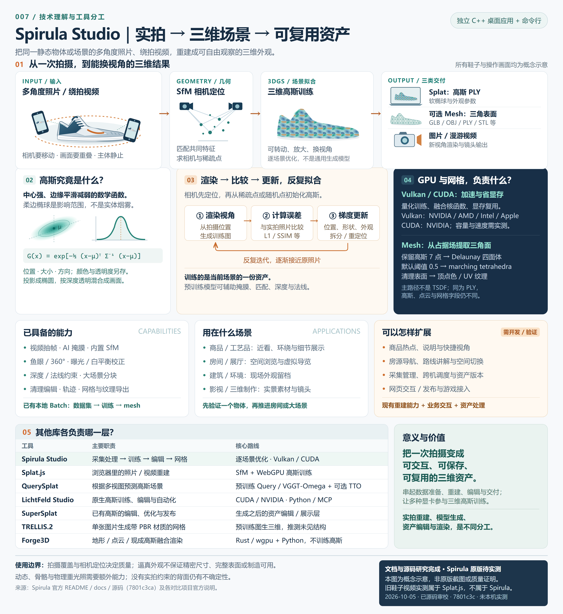
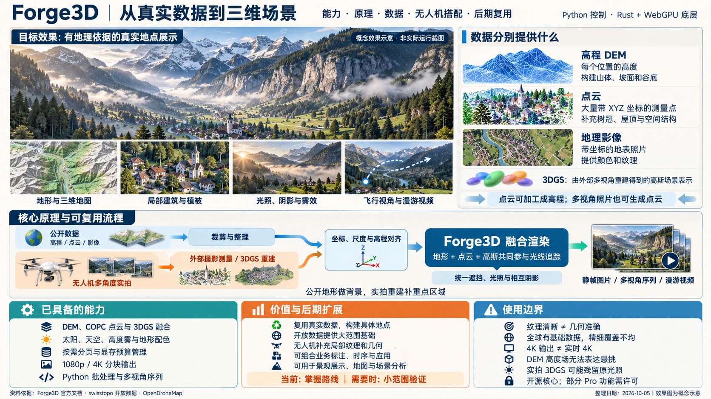
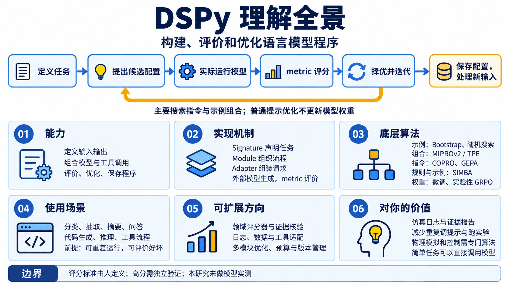

# 项目与产品研究集

这里汇总近期发现的优秀开源项目与产品，记录它们解决的问题、核心设计、体验效果、运行方式与实践结论。每个子项目都有独立的研究文档、截图和实验目录；本页负责摘要介绍、顺序索引和图片预览。

[研究指南](docs/research-guide.md) · [子项目目录](projects/README.md) · [Web 演示与部署](docs/deployment.md) · [在线研究目录](https://yydshly.github.io/1004_codex_project/) · [目录网页源码](site/index.html)

## 项目索引

子项目使用至少三位的固定编号，按 `001`、`002`、`003` 的顺序展示。编号分配后保留，归档不会改变其他项目的顺序。索引由 [projects.json](projects.json) 统一维护。 表格将状态与标签合并到项目栏，摘要占主要宽度；按 **能力、原理、使用场景、价值、边界** 分行阅读，右侧直接打开对应的在线研究网页。

<!-- PROJECT_INDEX:START -->

<table width="100%">
<thead><tr><th align="left" width="20%">项目</th><th align="left" width="68%">摘要</th><th align="left" width="12%">入口</th></tr></thead>
<tbody>
<tr><td valign="top"><strong>001 · <a href="projects/001-taskview-community/README.md">TaskView Community</a></strong><br>已完成<br><sub>任务管理、MCP、Agent 接入</sub></td><td valign="top"><strong>能力：</strong>可自托管的项目与任务管理平台，提供看板、子任务、依赖图、成员权限、工时统计与重复任务，并以 API、MCP、Webhook 连接外部系统。<br><strong>原理：</strong>Vue 界面经 Express 鉴权与业务层写入 PostgreSQL；任务、关系和状态共享数据，事件总线与后台队列处理通知和重复事项。<br><strong>使用场景：</strong>内部团队研发、交付管理、Issue 汇总；人或外部 Agent 读取任务、执行工作并回写结果。<br><strong>价值：</strong>复用任务模型、权限、接口和人机共用进度面板；后续可补领取、隔离、重试与验收，集中建设执行层。<br><strong>边界：</strong>本次仅源码与文档研究，未部署原版；平台不内置自主任务执行器。Source-Available 允许内部使用，向第三方开放实例需商业许可。</td><td valign="top"><a href="https://yydshly.github.io/1004_codex_project/demos/001-taskview-community/">研究网页</a><br><a href="projects/001-taskview-community/README.md">研究记录</a><br><a href="https://github.com/Gimanh/taskview-community">TaskView Community</a></td></tr>
<tr><td valign="top"><strong>002 · <a href="projects/002-codeflow/README.md">CodeFlow · 代码结构可视化与轻量分析</a></strong><br>已完成<br><sub>代码结构、静态分析、工具对比</sub></td><td valign="top"><strong>能力：</strong>无需业务后端；输入 GitHub 仓库、PR、本地源码或 Markdown，输出十种交互视图、源码卡片、指标、潜在影响与报告；提供 CLI 监听、Card 历史及无界面 JSON。<br><strong>原理：</strong>Babel / Acorn、Tree-sitter 与后备规则抽取定义和引用，以名称和导入归属推断文件关系，另提取 import、组件及路由架构。<br><strong>使用场景：</strong>接手陌生仓库、审查变更、定位关联、寻找重构线索、展示规模与观察指标趋势。<br><strong>价值：</strong>用可核对的局部关系组织阅读与检查；真实源码原生演示及 Source Insight、Ix、GitNexus 对照帮助按职责选工具。<br><strong>边界：</strong>原生样本已跑出 15 文件、33 函数、42 静态连接；不代表运行轨迹或准确率。解析、抽样与规则提示需源码和测试核验，另三工具未实跑。</td><td valign="top"><a href="https://yydshly.github.io/1004_codex_project/demos/002-codeflow/#understanding">研究网页</a><br><a href="projects/002-codeflow/README.md">研究记录</a><br><a href="https://github.com/braedonsaunders/codeflow">CodeFlow</a></td></tr>
<tr><td valign="top"><strong>003 · <a href="projects/003-cozy-nature-worlds/README.md">自然氛围与可探索造景 · Protopop 产品研究</a></strong><br>研究中<br><sub>自然氛围、造景与探索、产品研究</sub></td><td valign="top"><strong>能力：</strong>以 Cozy Country 为参考研究造景与探索；原创 Three.js 原型「一隅」已支持树草花布置、擦除撤销、泉眼重排、漫游、环境切换和保存恢复，图文导览关联目标、过程、实现、验证与扩展计划。<br><strong>原理：</strong>Three.js 提供场景、相机、材质与浏览器渲染；一隅结合高度场、实例化植被、参数曲线河流与共同生成的河谷、流水 Shader 和世界存档。自然感取决于资产、配色、光影与构图的配合。<br><strong>使用场景：</strong>个人自然空间、轻度造景与休闲探索，以及团队评审和技术验证；绘画、故事布景、拍照与分享为后续候选用途。<br><strong>价值：</strong>将观赏连接到亲手创造、进入成果和继续修改；沉淀原作与原型对照、可试玩底座和验收依据。扩展先验证溪流视觉样板，再规划八组 37 个条目、六种组合笔刷与三个模板。<br><strong>边界：</strong>功能底座已交付，视觉尚未达到参考效果；37／6／3 扩展均未实现，当前暂停深入开发。未试玩或复现原游戏；原型没有积水、水量守恒、声音或植被风。16 项自动检查及核心浏览器流程通过，真实设备性能、下载落盘和用户回访仍待验证。</td><td valign="top"><a href="https://yydshly.github.io/1004_codex_project/demos/003-cozy-nature-worlds/research/README.html">研究网页</a><br><a href="https://yydshly.github.io/1004_codex_project/demos/003-cozy-nature-worlds/research/expansion-plan.html">扩展计划</a><br><a href="projects/003-cozy-nature-worlds/README.md">研究记录</a><br><a href="https://x.com/protopop">Protopop Games · Cozy Country</a></td></tr>
<tr><td valign="top"><strong>004 · <a href="projects/004-scene-style-atlas/README.md">场景与模型风格图谱 · Defilade 视觉研究</a></strong><br>已完成<br><sub>游戏美术、场景与模型、风格沉淀</sub></td><td valign="top"><strong>能力：</strong>从 Defilade 官方中景参考出发，原创 Three.js 样板提供三场景三风格、建筑植被道路车辆细化和人物对照，保留 V1 / V2 及同机位截图。<br><strong>原理：</strong>用程序几何和预设分别改变布局、比例、材质光影、动态反馈与镜头尺度，固定条件比较整体体感与制作差距。<br><strong>使用场景：</strong>美术选型、正式资产前的目标检查、团队沟通、原型演示与回顾；后续可把场景状态连接故事、玩家行动和游戏系统。<br><strong>价值：</strong>沉淀比例、配色、材料、镜头和模块规则及真实证据，为风格方案库、场景组合和营地状态体验准备依据。<br><strong>边界：</strong>区分官方画面、实时结果、AI 概念和设计假设；人物停在 V3。候选扩展未实现，不是完整游戏或正式资产库，玩家偏好与性能尚未验证。</td><td valign="top"><a href="https://yydshly.github.io/1004_codex_project/demos/004-scene-style-atlas/understanding/">研究网页</a><br><a href="projects/004-scene-style-atlas/README.md">研究记录</a><br><a href="https://x.com/nexindie/status/2106723291868373127">Defilade · @nexindie</a></td></tr>
<tr><td valign="top"><strong>005 · <a href="projects/005-water-duck-loops/README.md">水流与鸭子互动 · 循环玩法研究</a></strong><br>研究中<br><sub>水流互动、循环玩法、像素场景</sub></td><td valign="top"><strong>能力：</strong>参考视频的水鸭视觉与编辑器配色、PNG / SVG 导出；原创 V1 自由玩水、V2 引流、V3 可读水流、V4 蓄水救援可试玩，附九模块总图、本地记录与 JSON 导出。<br><strong>原理：</strong>速度场、涟漪推力、分仓水量和状态规则连接操作、水的变化、鸭子响应、目标反馈与可见回程；V4 检验有限水量下的放水时机。<br><strong>使用场景：</strong>轻度解谜、休闲救援及互动展示原型；后续可研究搭水路、不同鸭子、跨区连锁与瀑布花园。<br><strong>价值：</strong>沉淀水鸭机制、素材、关卡参数和实验案例，用于后续原型复用、方案评审与团队沟通。<br><strong>边界：</strong>已有程序检查和两种放水案例，未证明人类玩家理解、策略平衡或长期可玩性。原视频身份、与编辑器关系及算法未知；规则近似非完整流体，C–F 待实现。</td><td valign="top"><a href="https://yydshly.github.io/1004_codex_project/demos/005-water-duck-loops/">研究网页</a><br><a href="projects/005-water-duck-loops/README.md">研究记录</a><br><a href="https://x.com/duck_wtd/status/2106807563073339790">Duck · @duck_wtd</a></td></tr>
<tr><td valign="top"><strong>006 · <a href="projects/006-claude-code-best-practice/README.md">Claude Code Best Practice · 能力与工作流研究</a></strong><br>已完成<br><sub>Claude Code、工作流编排、上下文工程</sub></td><td valign="top"><strong>能力：</strong>Claude Code 社区资料、配置模板与工作流参考实现；总图覆盖 47 项主题、8 组 63 条目，说明知识、协作、权限、会话、持续工作、外部系统及本库示例。<br><strong>原理：</strong>以项目记忆、Commands / Skills、Subagents、Hooks 和 MCP 组织上下文、交接与工具反馈；实际推理和操作由 Claude Code 运行时及外部服务完成。<br><strong>使用场景：</strong>代码研究与审查、复杂开发、团队交接、资料维护和外部工具接入。<br><strong>价值：</strong>保存项目知识、复用流程、减少重复说明与遗漏，并明确验收；原创选用指南、审查模板和交互图帮助理解分工。<br><strong>边界：</strong>已检查研究网页和下载包，未执行上游天气、RPI 或跨模型流程。文字要求不等于硬性权限；收益需连同适配、维护、模型与协调成本验证。</td><td valign="top"><a href="https://yydshly.github.io/1004_codex_project/demos/006-claude-code-best-practice/">研究网页</a><br><a href="projects/006-claude-code-best-practice/README.md">研究记录</a><br><a href="https://github.com/shanraisshan/claude-code-best-practice">Claude Code Best Practice</a></td></tr>
<tr><td valign="top"><strong>007 · <a href="projects/007-spirula-studio/README.md">Spirula Studio · 实拍三维重建与高斯原理</a></strong><br>研究中<br><sub>实拍三维重建、3D Gaussian Splatting、输入输出与工具对比</sub></td><td valign="top"><strong>能力：</strong>独立 C++桌面与 CLI 将多角度照片、绕拍视频经抽帧、掩膜和相机求解，生成可编辑高斯、带纹理网格、图片与漫游视频，支持本地批处理。<br><strong>原理：</strong>SfM 恢复观察关系，可微渲染以照片误差优化高斯并控制密度；占据场经四面体化提取网格，Vulkan / CUDA、量化与内存复用支撑计算。<br><strong>使用场景：</strong>商品和文物展示、空间导览、内容制作、实拍留档与重建研究。<br><strong>价值：</strong>把实拍转为可保存、重载和复用的三维资产；结合六类工具分工对照，可继续扩展采集引导、质量验收、跨机调度和资产管理。<br><strong>边界：</strong>资料与源码研究完成，Spirula 未本机运行；历史鞋子实测属于 Splat.js。多视图覆盖影响质量，外观逼真不保证测量、制造精度或容量性能。</td><td valign="top"><a href="https://yydshly.github.io/1004_codex_project/demos/007-spirula-studio/">研究网页</a><br><a href="projects/007-spirula-studio/README.md">研究记录</a><br><a href="https://github.com/harry7557558/spirula-studio">Spirula Studio</a></td></tr>
<tr><td valign="top"><strong>008 · <a href="projects/008-forge3d/README.md">Forge3D · 真实数据融合与三维场景渲染</a></strong><br>已完成<br><sub>地理三维、数据融合、高程与点云、3DGS、无人机重建、产品复用</sub></td><td valign="top"><strong>能力：</strong>Python 驱动、Rust / WebGPU 实现的地理渲染库，融合准备好的 DEM、COPC 点云与现成 3DGS，输出地形地图、场景图片和飞行序列；支持太阳、阴影、雾与覆盖层。<br><strong>原理：</strong>数据裁剪、配准并统一坐标及高程基准后，以统一 ReSTIR 路径追踪计算相互遮挡；影像提供颜色，分块与按需分页控制渲染工作集。<br><strong>使用场景：</strong>地点导览、真实数字场景、路线镜头和规划沟通；开放数据做远景，无人机经外部摄影测量或 3DGS 重建补近景。<br><strong>价值：</strong>复用真实数据表达具体地点，区分高程形状、空间点与影像外观；引导图和导览沉淀路线，后续可补采集质量、资产管理与任务发布。<br><strong>边界：</strong>原版未本机运行，不负责照片重建或高斯训练。4K 非实时承诺，纹理不替代几何；全球精细数据覆盖不均，DEM 不含悬挑，高斯可能残留光照。作者完整包未确认公开，公开基准为程序色；核心、Pro 与数据授权分开核对。</td><td valign="top"><a href="https://yydshly.github.io/1004_codex_project/demos/008-forge3d/">研究网页</a><br><a href="projects/008-forge3d/README.md">研究记录</a><br><a href="https://github.com/milos-agathon/forge3d">Forge3D</a></td></tr>
<tr><td valign="top"><strong>009 · <a href="projects/009-dspy/README.md">DSPy 原理算法与评分机制研究</a></strong><br>研究中<br><sub>语言模型程序、提示优化、评分机制、仿真分析</sub></td><td valign="top"><strong>能力：</strong>DSPy 是构建、评估和优化语言模型程序的 Python 框架，可声明结构化输入输出、组合模型与工具调用、记录轨迹并保存优化配置；具体生成与推理能力来自接入的模型。<br><strong>原理：</strong>Signature 定义任务，Module 组织流程，Adapter 组装请求；在案例上执行候选，以规则、参考答案、执行检验或评判模型提供的 metric 评分。算法能力包括 Bootstrap 筛选轨迹为示例、BootstrapRS 随机搜索示例组合、MIPROv2 用 Optuna TPE 联合搜索指令与示例、COPRO 逐模块改进指令、SIMBA 小批次归纳规则与示例、GEPA 利用反馈反思演化；微调和实验性 GRPO 连接外部训练后端。<br><strong>使用场景：</strong>可重复且可评价的分类、抽取、摘要、检索问答、代码生成、数学与规则推理、工具流程及日志报告；不要求每次输入海量资料，可扩展领域评分、数据工具适配和多模块优化。<br><strong>价值：</strong>对你的无人机仿真，适合作为离线日志分析、异常提取与带证据报告的辅助层；对研究库，可复用资料整理与引用核验流程。主要收益是减少人工调提示、组合示例、跑测试和维护配置的重复工作，是否采用要与直接调用模型比较。<br><strong>边界：</strong>物理模拟、传感器建模、状态估计和实时控制需专门算法；单次任务或稳定提示可能无需 DSPy。普通提示优化不改模型权重，高分不保证真实正确，收益需覆盖数据、调用与维护成本。本研究为资料与源码整理，尚未做 DSPy 模型实测。</td><td valign="top"><a href="https://yydshly.github.io/1004_codex_project/demos/009-dspy/">研究网页</a><br><a href="projects/009-dspy/README.md">研究记录</a><br><a href="https://github.com/stanfordnlp/dspy">DSPy</a></td></tr>
<tr><td valign="top"><strong>010 · <a href="projects/010-ra2web/README.md">RA2WEB · 网页版红警游戏</a></strong><br>已归档<br><sub>网页游戏、红警、即时战略、后续参考</sub></td><td valign="top">RA2WEB 是一个网页版红警游戏项目，仓库提供网页客户端、游戏资源与部署包，附带玩家脚本控制接口。后续开发类似网页游戏或经典游戏网页复刻项目时可作为参考；当前仅记录归档，暂不研究。</td><td valign="top">网页待准备<br><a href="projects/010-ra2web/README.md">研究记录</a><br><a href="https://github.com/ra2web/ra2web.github.io">RA2WEB</a></td></tr>
</tbody>
</table>

<!-- PROJECT_INDEX:END -->

## 图片预览

每个子项目以理解汇总图或真实运行截图作为引导图，配上能力、原理、输入输出和使用场景摘要；图的性质与验证范围在研究文档中说明。引导图会同步到这里和 Web 索引页。

<!-- PROJECT_GALLERY:START -->

### **001 · TaskView Community**

**能力：** 可自托管的项目与任务管理平台，提供看板、子任务、依赖图、成员权限、工时统计与重复任务，并以 API、MCP、Webhook 连接外部系统。

**原理：** Vue 界面经 Express 鉴权与业务层写入 PostgreSQL；任务、关系和状态共享数据，事件总线与后台队列处理通知和重复事项。

**使用场景：** 内部团队研发、交付管理、Issue 汇总；人或外部 Agent 读取任务、执行工作并回写结果。

**价值：** 复用任务模型、权限、接口和人机共用进度面板；后续可补领取、隔离、重试与验收，集中建设执行层。

**边界：** 本次仅源码与文档研究，未部署原版；平台不内置自主任务执行器。Source-Available 允许内部使用，向第三方开放实例需商业许可。

[研究记录](projects/001-taskview-community/README.md) · [研究网页](https://yydshly.github.io/1004_codex_project/demos/001-taskview-community/) · [TaskView Community](https://github.com/Gimanh/taskview-community)



### **002 · CodeFlow · 代码结构可视化与轻量分析**

**能力：** 无需业务后端；输入 GitHub 仓库、PR、本地源码或 Markdown，输出十种交互视图、源码卡片、指标、潜在影响与报告；提供 CLI 监听、Card 历史及无界面 JSON。

**原理：** Babel / Acorn、Tree-sitter 与后备规则抽取定义和引用，以名称和导入归属推断文件关系，另提取 import、组件及路由架构。

**使用场景：** 接手陌生仓库、审查变更、定位关联、寻找重构线索、展示规模与观察指标趋势。

**价值：** 用可核对的局部关系组织阅读与检查；真实源码原生演示及 Source Insight、Ix、GitNexus 对照帮助按职责选工具。

**边界：** 原生样本已跑出 15 文件、33 函数、42 静态连接；不代表运行轨迹或准确率。解析、抽样与规则提示需源码和测试核验，另三工具未实跑。

[研究记录](projects/002-codeflow/README.md) · [研究网页](https://yydshly.github.io/1004_codex_project/demos/002-codeflow/#understanding) · [CodeFlow](https://github.com/braedonsaunders/codeflow)



### **003 · 自然氛围与可探索造景 · Protopop 产品研究**

**能力：** 以 Cozy Country 为参考研究造景与探索；原创 Three.js 原型「一隅」已支持树草花布置、擦除撤销、泉眼重排、漫游、环境切换和保存恢复，图文导览关联目标、过程、实现、验证与扩展计划。

**原理：** Three.js 提供场景、相机、材质与浏览器渲染；一隅结合高度场、实例化植被、参数曲线河流与共同生成的河谷、流水 Shader 和世界存档。自然感取决于资产、配色、光影与构图的配合。

**使用场景：** 个人自然空间、轻度造景与休闲探索，以及团队评审和技术验证；绘画、故事布景、拍照与分享为后续候选用途。

**价值：** 将观赏连接到亲手创造、进入成果和继续修改；沉淀原作与原型对照、可试玩底座和验收依据。扩展先验证溪流视觉样板，再规划八组 37 个条目、六种组合笔刷与三个模板。

**边界：** 功能底座已交付，视觉尚未达到参考效果；37／6／3 扩展均未实现，当前暂停深入开发。未试玩或复现原游戏；原型没有积水、水量守恒、声音或植被风。16 项自动检查及核心浏览器流程通过，真实设备性能、下载落盘和用户回访仍待验证。

[研究记录](projects/003-cozy-nature-worlds/README.md) · [研究网页](https://yydshly.github.io/1004_codex_project/demos/003-cozy-nature-worlds/research/README.html) · [扩展计划](https://yydshly.github.io/1004_codex_project/demos/003-cozy-nature-worlds/research/expansion-plan.html) · [Protopop Games · Cozy Country](https://x.com/protopop)



### **004 · 场景与模型风格图谱 · Defilade 视觉研究**

**能力：** 从 Defilade 官方中景参考出发，原创 Three.js 样板提供三场景三风格、建筑植被道路车辆细化和人物对照，保留 V1 / V2 及同机位截图。

**原理：** 用程序几何和预设分别改变布局、比例、材质光影、动态反馈与镜头尺度，固定条件比较整体体感与制作差距。

**使用场景：** 美术选型、正式资产前的目标检查、团队沟通、原型演示与回顾；后续可把场景状态连接故事、玩家行动和游戏系统。

**价值：** 沉淀比例、配色、材料、镜头和模块规则及真实证据，为风格方案库、场景组合和营地状态体验准备依据。

**边界：** 区分官方画面、实时结果、AI 概念和设计假设；人物停在 V3。候选扩展未实现，不是完整游戏或正式资产库，玩家偏好与性能尚未验证。

[研究记录](projects/004-scene-style-atlas/README.md) · [研究网页](https://yydshly.github.io/1004_codex_project/demos/004-scene-style-atlas/understanding/) · [Defilade · @nexindie](https://x.com/nexindie/status/2106723291868373127)



### **005 · 水流与鸭子互动 · 循环玩法研究**

**能力：** 参考视频的水鸭视觉与编辑器配色、PNG / SVG 导出；原创 V1 自由玩水、V2 引流、V3 可读水流、V4 蓄水救援可试玩，附九模块总图、本地记录与 JSON 导出。

**原理：** 速度场、涟漪推力、分仓水量和状态规则连接操作、水的变化、鸭子响应、目标反馈与可见回程；V4 检验有限水量下的放水时机。

**使用场景：** 轻度解谜、休闲救援及互动展示原型；后续可研究搭水路、不同鸭子、跨区连锁与瀑布花园。

**价值：** 沉淀水鸭机制、素材、关卡参数和实验案例，用于后续原型复用、方案评审与团队沟通。

**边界：** 已有程序检查和两种放水案例，未证明人类玩家理解、策略平衡或长期可玩性。原视频身份、与编辑器关系及算法未知；规则近似非完整流体，C–F 待实现。

[研究记录](projects/005-water-duck-loops/README.md) · [研究网页](https://yydshly.github.io/1004_codex_project/demos/005-water-duck-loops/) · [Duck · @duck\_wtd](https://x.com/duck_wtd/status/2106807563073339790)



### **006 · Claude Code Best Practice · 能力与工作流研究**

**能力：** Claude Code 社区资料、配置模板与工作流参考实现；总图覆盖 47 项主题、8 组 63 条目，说明知识、协作、权限、会话、持续工作、外部系统及本库示例。

**原理：** 以项目记忆、Commands / Skills、Subagents、Hooks 和 MCP 组织上下文、交接与工具反馈；实际推理和操作由 Claude Code 运行时及外部服务完成。

**使用场景：** 代码研究与审查、复杂开发、团队交接、资料维护和外部工具接入。

**价值：** 保存项目知识、复用流程、减少重复说明与遗漏，并明确验收；原创选用指南、审查模板和交互图帮助理解分工。

**边界：** 已检查研究网页和下载包，未执行上游天气、RPI 或跨模型流程。文字要求不等于硬性权限；收益需连同适配、维护、模型与协调成本验证。

[研究记录](projects/006-claude-code-best-practice/README.md) · [研究网页](https://yydshly.github.io/1004_codex_project/demos/006-claude-code-best-practice/) · [Claude Code Best Practice](https://github.com/shanraisshan/claude-code-best-practice)



### **007 · Spirula Studio · 实拍三维重建与高斯原理**

**能力：** 独立 C++桌面与 CLI 将多角度照片、绕拍视频经抽帧、掩膜和相机求解，生成可编辑高斯、带纹理网格、图片与漫游视频，支持本地批处理。

**原理：** SfM 恢复观察关系，可微渲染以照片误差优化高斯并控制密度；占据场经四面体化提取网格，Vulkan / CUDA、量化与内存复用支撑计算。

**使用场景：** 商品和文物展示、空间导览、内容制作、实拍留档与重建研究。

**价值：** 把实拍转为可保存、重载和复用的三维资产；结合六类工具分工对照，可继续扩展采集引导、质量验收、跨机调度和资产管理。

**边界：** 资料与源码研究完成，Spirula 未本机运行；历史鞋子实测属于 Splat.js。多视图覆盖影响质量，外观逼真不保证测量、制造精度或容量性能。

[研究记录](projects/007-spirula-studio/README.md) · [研究网页](https://yydshly.github.io/1004_codex_project/demos/007-spirula-studio/) · [Spirula Studio](https://github.com/harry7557558/spirula-studio)



### **008 · Forge3D · 真实数据融合与三维场景渲染**

**能力：** Python 驱动、Rust / WebGPU 实现的地理渲染库，融合准备好的 DEM、COPC 点云与现成 3DGS，输出地形地图、场景图片和飞行序列；支持太阳、阴影、雾与覆盖层。

**原理：** 数据裁剪、配准并统一坐标及高程基准后，以统一 ReSTIR 路径追踪计算相互遮挡；影像提供颜色，分块与按需分页控制渲染工作集。

**使用场景：** 地点导览、真实数字场景、路线镜头和规划沟通；开放数据做远景，无人机经外部摄影测量或 3DGS 重建补近景。

**价值：** 复用真实数据表达具体地点，区分高程形状、空间点与影像外观；引导图和导览沉淀路线，后续可补采集质量、资产管理与任务发布。

**边界：** 原版未本机运行，不负责照片重建或高斯训练。4K 非实时承诺，纹理不替代几何；全球精细数据覆盖不均，DEM 不含悬挑，高斯可能残留光照。作者完整包未确认公开，公开基准为程序色；核心、Pro 与数据授权分开核对。

[研究记录](projects/008-forge3d/README.md) · [研究网页](https://yydshly.github.io/1004_codex_project/demos/008-forge3d/) · [Forge3D](https://github.com/milos-agathon/forge3d)



### **009 · DSPy 原理算法与评分机制研究**

**能力：** DSPy 是构建、评估和优化语言模型程序的 Python 框架，可声明结构化输入输出、组合模型与工具调用、记录轨迹并保存优化配置；具体生成与推理能力来自接入的模型。

**原理：** Signature 定义任务，Module 组织流程，Adapter 组装请求；在案例上执行候选，以规则、参考答案、执行检验或评判模型提供的 metric 评分。算法能力包括 Bootstrap 筛选轨迹为示例、BootstrapRS 随机搜索示例组合、MIPROv2 用 Optuna TPE 联合搜索指令与示例、COPRO 逐模块改进指令、SIMBA 小批次归纳规则与示例、GEPA 利用反馈反思演化；微调和实验性 GRPO 连接外部训练后端。

**使用场景：** 可重复且可评价的分类、抽取、摘要、检索问答、代码生成、数学与规则推理、工具流程及日志报告；不要求每次输入海量资料，可扩展领域评分、数据工具适配和多模块优化。

**价值：** 对你的无人机仿真，适合作为离线日志分析、异常提取与带证据报告的辅助层；对研究库，可复用资料整理与引用核验流程。主要收益是减少人工调提示、组合示例、跑测试和维护配置的重复工作，是否采用要与直接调用模型比较。

**边界：** 物理模拟、传感器建模、状态估计和实时控制需专门算法；单次任务或稳定提示可能无需 DSPy。普通提示优化不改模型权重，高分不保证真实正确，收益需覆盖数据、调用与维护成本。本研究为资料与源码整理，尚未做 DSPy 模型实测。

[研究记录](projects/009-dspy/README.md) · [研究网页](https://yydshly.github.io/1004_codex_project/demos/009-dspy/) · [DSPy](https://github.com/stanfordnlp/dspy)



### **010 · RA2WEB · 网页版红警游戏**

RA2WEB 是一个网页版红警游戏项目，仓库提供网页客户端、游戏资源与部署包，附带玩家脚本控制接口。后续开发类似网页游戏或经典游戏网页复刻项目时可作为参考；当前仅记录归档，暂不研究。

[研究记录](projects/010-ra2web/README.md) · [RA2WEB](https://github.com/ra2web/ra2web.github.io)

截图：待补充。

<!-- PROJECT_GALLERY:END -->

## 添加一个研究项目

需要 Python 3.10 或更高版本，无需安装额外 Python 依赖。在仓库根目录执行以下命令，将示例参数替换为实际项目的信息：

```sh
python scripts/catalog.py add --slug your-project --name "项目名称" --repo "https://github.com/owner/repo" --summary "这个项目解决什么问题，为什么值得研究"
```

没有公开源码仓库的产品使用 `--source "https://example.com/product"` 代替 `--repo`，以产品官网或作者主页作为研究来源。

命令自动分配下一个编号、创建 `projects/NNN-slug/` 研究目录并同步索引。随后编辑项目 README 和笔记，放入截图，按需补充静态 Web 演示。

修改 [projects.json](projects.json) 中的摘要、状态、标签或封面后，运行：

```sh
python scripts/catalog.py sync
python scripts/catalog.py check
```

`sync` 更新本页生成区块和 `site/` 目录；`check` 检查编号、元数据、文件路径及生成结果是否一致。生成区块中的内容应通过项目清单更新。

## 目录结构

| 路径 | 用途 |
| --- | --- |
| `projects.json` | 项目清单、固定编号、摘要和展示信息 |
| `projects/NNN-slug/` | 各子项目的研究说明、笔记、图片和实验 |
| `templates/project/` | 新子项目的文档模板 |
| `assets/images/` | 总项目库共用的图片 |
| `docs/` | 研究约定和 Web 部署说明 |
| `scripts/catalog.py` | 新建项目、同步索引和校验 |
| `site/` | 生成的静态索引及多个子项目 Web 演示 |
| `.github/workflows/` | 仓库检查及自动 / 手动 Pages 发布流程 |

## Web 演示

每个子项目可在自己的 `demo/` 目录中放置静态页面。同步时，这些页面会汇总到 `site/demos/NNN-slug/`，通过一个 GitHub Pages 站点访问多个演示。

仓库已配置提交后自动发布，并保留手动入口。启用方式和路径约定见 [部署说明](docs/deployment.md)。各项目研究网页汇总到同一个 GitHub Pages 站点，目录脚本检查项目和网页是否对应，再由工作流测试、生成、校验并发布。

## 研究约定

- 记录研究时使用的上游版本、提交或公开资料日期，便于重复验证。
- 将自己的观察和复现结论写入研究文档，引用上游资料时注明来源。
- 子项目实际截图保存在各自 `assets/` 目录，并使用相对路径引用。
- 上游源码、依赖、许可证和运行步骤由子项目分别管理；详细规则见 [研究指南](docs/research-guide.md)。
