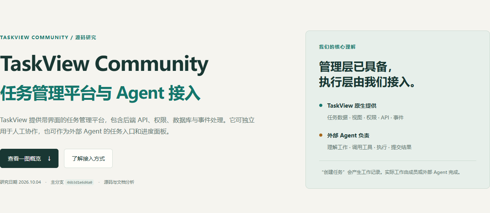

# 001 · TaskView Community

可自托管的项目与任务管理平台，以任务、看板、依赖图、权限与工时报表组织工作；通过 HTTP API、MCP 和 Webhook 连接外部 Agent，可作为后续执行系统的任务入口和进度管理层。

[返回总索引](../../README.md) · [研究笔记](notes.md) · [Gimanh/taskview-community](https://github.com/Gimanh/taskview-community)

## **核心结论**

**TaskView 是任务管理的全栈产品，提供可视化界面、业务 API、数据库、权限和后台业务处理。** 它解决“有哪些工作、谁负责、做到哪里、任务之间怎样关联”的问题。普通团队由成员执行工作；接入外部 Agent 后，平台可以成为任务入口和进度面板。

本次检查没有发现内置自主接单、工具执行、失败恢复和结果验收的 Agent 执行器。它支持 Agent 通过接口读写任务；真正编写代码、生成文件或运行测试的能力，需要外部执行层提供。对我们后续的意义主要是复用或借鉴管理层，并以清晰接口连接执行层。

| 项目 | 信息 |
| --- | --- |
| 固定编号 | `001` |
| 项目目录 | `001-taskview-community` |
| 短名 | `taskview-community` |
| 源仓库 | [Gimanh/taskview-community](https://github.com/Gimanh/taskview-community) |
| 研究版本 | `46b3d1e6d4a0672e577d84e49906c1c78f22a74f`，2026-10-04 检查 |
| 上游许可 | [Source-Available License](https://github.com/Gimanh/taskview-community/blob/46b3d1e6d4a0672e577d84e49906c1c78f22a74f/LICENSE.md) |
| 研究状态 | 源码与文档研究完成；尚未部署复现 TaskView |

## **原库具备哪些能力**

| 能力 | 具体作用 | 边界 |
| --- | --- | --- |
| 项目、列表、看板、任务和子任务 | 拆分工作，配置负责人、优先级、日期、状态，保存历史 | 管理工作记录，执行者由人或外部系统承担 |
| 任务依赖图 | 保存任务关系，用 Vue Flow / Dagre 展示和自动布局 | 图布局不等于自主规划或自动执行依赖链 |
| 工时、统计和重复任务 | 记录投入、查看统计，生成下一次重复任务 | 后台自动化围绕平台业务 |
| 组织、成员、角色和细粒度权限 | 控制界面与 API 的项目访问和操作范围 | Agent 接入同样需要授权 |
| Web / 移动端、HTTP API、TypeScript 客户端 | 给成员、脚本和外部应用不同操作入口 | 客户端最终调用后端业务接口 |
| MCP、Webhook、消息和代码仓库集成 | 对外开放工具调用、业务事件和通知 | Git 集成主要涉及 Issue / 任务与完成状态，不代表 PR / CI 全量双向同步 |

功能和技术依据来自 [Gimanh/taskview-community 固定提交](https://github.com/Gimanh/taskview-community/tree/46b3d1e6d4a0672e577d84e49906c1c78f22a74f)；具体源文件见 [notes.md](notes.md)。

## **架构与底层原理**

`Vue / TypeScript 界面 → Node.js / Express HTTP API → 登录与权限检查 → 业务层 → Drizzle ORM / PostgreSQL`

后端按路由、中间件、Controller、Manager、Repository 组织职责。一次任务修改先检查身份、项目权限和授权范围，再写入数据库。任务的 `parentId` 表达子任务，`statusId` 表达工作流状态，`complete` 是独立完成标记；依赖关系表保存任务之间的边。列表、看板、详情和关系图围绕同一份数据提供不同视图。

任务创建、修改、完成等操作进入 EventBus，通知、Webhook、重复任务等模块执行后续动作。pg-boss 使用 PostgreSQL 管理后台作业；可选实时推送帮助界面获取变化。这里的后台“驱动”是业务事件与作业处理：例如保存完成状态、发送通知、生成重复任务实例。

## **入口与出口**

| 方向 | 接口或形式 | 进入 / 得到什么 |
| --- | --- | --- |
| 入口 | Web / 移动端界面 | 人定义项目和任务、分配成员、变更状态、记录投入 |
| 入口 | HTTP API / TypeScript 客户端 | 程序提交结构化查询、创建和修改请求 |
| 入口 | 本地 MCP stdio | 本地 AI 客户端调用任务工具，由 MCP 适配到 API |
| 入口 | 共享 HTTP MCP / OAuth | 后台或远程客户端在授权范围内调用工具；OAuth 管理授权而不执行任务 |
| 出口 | API 响应、界面、数据库 | 任务数据、状态、关系图、历史与统计 |
| 出口 | 消息通知 / 签名 Webhook | 业务变化通知或事件，可交给外部服务处理 |
| 出口 | 代码仓库集成 | 对应 Issue 的完成 / 重开状态回写等已有同步 |
| 外部执行产物 | 代码、报告、实际文件、测试结果 | 由人或外部 Agent 交付，再将状态与产物链接写回平台 |

输入“开发登录功能”保存的是工作描述。它本身不会把描述转换成登录代码；需要执行者完成工作。输出的任务状态也不自动证明实现已通过测试。

## **普通项目与 Agent 项目如何使用**

**人工项目示例**

创建“网站开发”项目，拆成“设计首页”“开发登录”“测试支付”，分配负责人和日期。成员在自己的工具中完成工作，在平台更新“进行中”“待评审”和完成标记。TaskView 保存变化并通知相关成员。内部研发、团队协作、工时记录和客户交付的内部管理均可采用这一模式。

**Agent 项目示例**

创建“给登录功能补充测试”任务，外部 Agent 读取描述，在隔离工作目录修改测试、运行验证，将测试报告和代码提交链接写回，并等待验收。TaskView 提供入口、权限、记录和展示；领取规则、工具执行、失败恢复和验收流程需要执行层实现。这个闭环是可构建方案，尚未在本次研究中运行验证。

## **如何接入本地与后台 Agent**

| 路线 | 前提与连接方式 |
| --- | --- |
| 本地 Agent + MCP stdio | 已有可访问的 TaskView 服务、支持 MCP 的本地客户端、MCP 运行环境和授权；配置 API 地址与凭据，本地 MCP 进程通过 API 读写任务 |
| 后台 Agent + HTTP MCP | 独立部署 Agent 与共享 MCP 服务，保证网络可达，按文档配置 OAuth / Token 和范围；Agent 使用远程工具调用 |
| 后台服务 + 直接 API / TS 客户端 | 使用接口客户端、身份凭据和对应权限；服务自行查询任务、执行与回写 |
| Webhook + 外部调度桥接 | 配置可接收平台事件的服务和签名校验，由桥接层选择事件并派发任务；属于拟议扩展 |

本地 Agent 不要求 TaskView 服务也部署在本机；“本地 / 后台”描述执行端位置。自动化仍需明确触发条件与授权边界。连接能力依据 [Gimanh/taskview-community MCP 文档](https://github.com/Gimanh/taskview-community/blob/46b3d1e6d4a0672e577d84e49906c1c78f22a74f/docs/3.integrations/2.mcp.md)。

## **对我们的价值与扩展方向**

可借鉴任务数据结构、角色权限、事件机制、接口封装与人机共用视图，也可评估直接复用它作为内部管理平台，从而把后续投入集中在执行与验收。若研究目标主要是自主规划、多 Agent 协作、工具调用和恢复，应同时寻找执行层项目；这些机制不能从管理界面直接获得。

拟议扩展包括任务领取与租约、重复派发抑制、执行隔离、失败重试、预算控制、产物链接、自动验收、人工审核和运行记录。需要明确任务管理状态与实际执行状态的映射。这些是我们的方向，不应列为原库已实现功能。

建议按“部署平台 → 只读 MCP → 测试项目写入 → 单任务执行闭环 → 受控事件派发”的顺序验证，每一步确认权限、状态和结果后再扩大范围。

## **研究网页与总览图**

[研究网页发布入口](https://yydshly.github.io/1004_codex_project/demos/001-taskview-community/) · [本地网页](demo/index.html) · [总览 PNG](assets/taskview-overview.png) · [总览 SVG](assets/taskview-overview.svg)

本次发布对象是研究网页。总览图复用已有研究图，网页截图来自自制页面；这些产物不构成上游 TaskView 部署成功的证据。

## **验证范围与许可**

本次仅静态检查源码和官方文档，未运行 TaskView、数据库或 MCP，未验证部署稳定性、接口兼容性、并发性能和实际 Agent 执行。部署入口见[官方安装文档](https://taskview.tech/docs/getting-started/installation)。完成部署和接口实验后再标记“已复现”。

当前 Source-Available License 允许个人及组织内部使用，内部员工与承包商在许可范围内；向外部客户或第三方开放实例，即使免费，也需要商业许可。托管服务和竞争产品还有相关限制。后续产品化决策应以 [Gimanh/taskview-community LICENSE.md](https://github.com/Gimanh/taskview-community/blob/46b3d1e6d4a0672e577d84e49906c1c78f22a74f/LICENSE.md)为准。

固定提交的具体证据和未验证事项见 [notes.md](notes.md)。本研究记录不改变上游许可。
