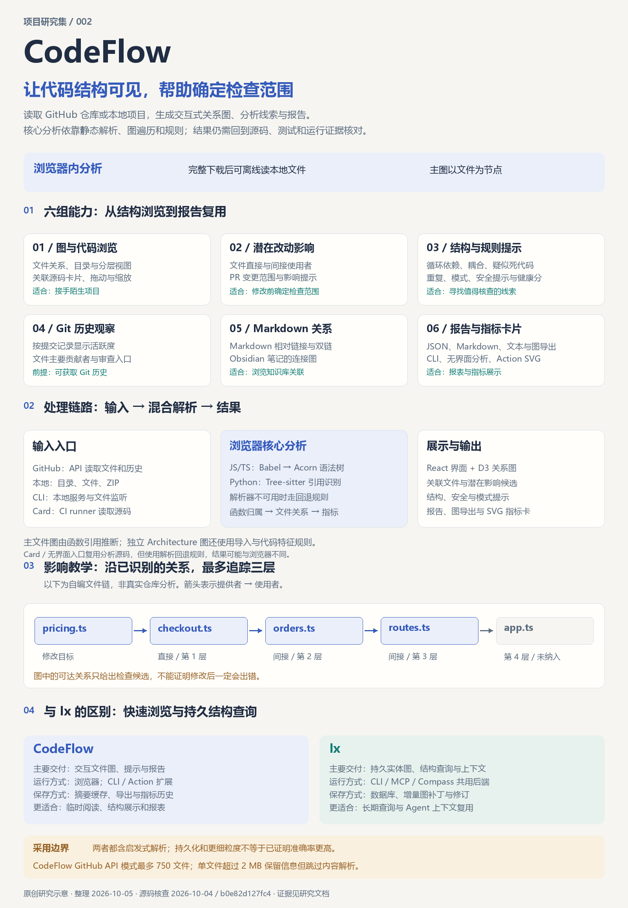

# 002 · CodeFlow · 代码结构可视化与轻量分析

**CodeFlow 把代码库中的文件、函数引用、导入、目录和指标整理成可交互的结构视图，帮助熟悉项目、定位关联文件、提出重构与审查候选。** 它与 Source Insight、Ix、GitNexus 共享“源码解析 → 结构索引/关系模型 → 查询或展示”的思路；价值要看能否完成定位、阅读和变更检查，不能从图的数量推断分析能力。

[返回总索引](../../README.md) · [研究笔记](notes.md) · [证据清单](sources.json) · [公开网页](https://yydshly.github.io/1004_codex_project/demos/002-codeflow/#understanding) · [本地展示页](demo/index.html) · [原生运行器](demo/runtime/index.html) · [样本源码](demo/fixtures/index.html)

公开网页为发布目标地址，部署状态与当前内容以发布验证为准。

| 摘要维度 | 理解与范围 |
| --- | --- |
| 能力 | 文件关联、函数引用、目录与规模浏览；潜在影响、循环、耦合、疑似死代码及规则式安全提示；GitHub 入口另提供有限历史指标。 |
| 输入 | GitHub 仓库或 PR、本地文件/文件夹、ZIP、Markdown 笔记；不同入口取得的源码与 Git 历史不同。 |
| 原理 | JS/TS 正常路径用 Babel + Acorn AST，Python 采用 Tree-sitter 引用提取，其余及失败路径有后备规则；按定义、名称与导入归属推断主文件关系，另建 import/组件/路由架构视图。 |
| 效果与输出 | 十种原生视图：关系投影与目录聚合、目录/行数规模、独立架构三类；附源码卡片、指标、提示与影响候选，支持 JSON、Markdown、文本、SVG、PDF 等导出。 |
| 接入与扩展 | CLI 提供本地网页和目录监听；Headless JSON 可接后续脚本，Card / GitHub Action 可生成 README SVG 与指标历史，导出产物可作二次展示。进一步增加解析规则或视图需修改源码，不能视作已有稳定插件 SDK 或持久图数据库。 |
| 验证与局限 | 固定提交实跑 15 文件、33 函数、42 静态连接；这不是运行轨迹、业务正确性或准确率证明。其他三工具仅官方材料比对，未做同样本运行或收益排名。 |

## 理解汇总图

[](demo/assets/codeflow-understanding.svg)

[网页理解汇总](demo/index.html#understanding) 支持放大、缩小、适合宽度、原尺寸阅读和 SVG 下载，也提供手机文字版。图中把解析、索引、接口与展示分开：**同一关系换布局不会增加源码事实；更可靠的解析、更细的关系与任务查询，才可能增加分析能力。** [桌面效果](assets/understanding-web-desktop.jpg) · [手机效果](assets/understanding-web-mobile.jpg) · [验证记录](verification.json)

| 项目 | 记录 |
| --- | --- |
| 固定编号 | `002` |
| 研究整理日期 | 2026-10-05，Asia/Shanghai |
| 源码依据 | 2026-10-04 核查的 [b0e82d1 固定提交](https://github.com/braedonsaunders/codeflow/tree/b0e82d127fc4990f571ebc6da6c5d9af2591aaa1)，本轮只读复核；不声明为最新提交 |
| 上游许可 | [MIT](https://github.com/braedonsaunders/codeflow/blob/b0e82d127fc4990f571ebc6da6c5d9af2591aaa1/LICENSE)，原作者 Braedon Saunders |
| 验证范围 | 15 文件真实样本及锁定提交的 CodeFlow 原生运行器；另外三工具仅官方材料核查，未做四工具准确率、生产性能或任务收益实测 |

## 输入、能力与输出

| 输入或入口 | 提供的能力 | 输出与条件 |
| --- | --- | --- |
| GitHub 仓库地址 | 扫描源码；观察函数引用、文件关联、Git 活跃度和主要贡献者 | 交互图、函数统计、结构与安全提示；私有仓库需授权，访问 GitHub API |
| 本地文件、文件夹、ZIP | 在浏览器分析；支持排除路径；Markdown 相对链接与 Wiki 链接也可成图 | 文件关系图与笔记关系图；本地扫描不自动取得 GitHub 历史 |
| GitHub PR 地址 | 显示改动文件及其潜在关联范围 | 审查与回归候选，不是证明哪些文件会坏 |
| 导出 | JSON、Markdown、文本、SVG、PDF 等 | 供记录、分享与二次处理；报告中的问题仍需核对 |
| 本地 CLI | 提供同一个网页并监听目录变化 | 浏览器分析随文件变化更新；不是独立数据库服务 |
| Card / Headless | GitHub Action 生成 README SVG 和指标历史；无界面入口输出 JSON | 可持续记录指标；PR 评论默认关闭，启用后会写入 GitHub |

分析项包含疑似死代码、循环依赖、耦合、重复代码、分层与模式提示，以及硬编码凭据、危险执行、注入等规则式风险提示。健康分把若干指标按规则折算成字母等级，适合提示和趋势观察。[功能说明](https://github.com/braedonsaunders/codeflow/blob/b0e82d127fc4990f571ebc6da6c5d9af2591aaa1/README.md#features) · [Card 文档](https://github.com/braedonsaunders/codeflow/blob/b0e82d127fc4990f571ebc6da6c5d9af2591aaa1/card/README.md)

## 从源码到图的原理

1. **取得文件**：浏览器直接访问 GitHub API，或读取用户选择的本地文件；过滤依赖、缓存、构建产物及自定义排除项。
2. **混合解析**：JS/TS 的正常路径由 Babel 处理 JSX/类型，再用 Acorn 遍历 AST 提取函数与调用/引用；失败时使用后备规则。Python 的 Tree-sitter 路径统计与已知函数同名的非定义标识符引用，包含回调等使用，不只统计真正调用。其他语言及后备路径采用相应规则；存在 WASM 文件不代表所有语言都走 Tree-sitter 主路径。
3. **推断主文件关系**：建立函数定义索引，按同文件、唯一名称、显式导入等规则解析归属。跨文件引用形成“定义函数的文件 → 引用它的文件”的边；歧义可能不连边。因此主图不是完整的 import 图，也不是运行时调用轨迹。
4. **另建架构视图**：独立提取 import/require、组件及路由等事实，构造块与关系；其中还含角色和规则推断。这条管线应与主文件关系图区分。
5. **计算与展示**：沿主图用 BFS 展开潜在依赖者，最多 3 层；健康分按疑似死代码、循环、Large 问题、连接密度和高严重度安全提示扣分。React 组织 UI，D3 绘制可交互图。

实现依据：[JS/TS AST](https://github.com/braedonsaunders/codeflow/blob/b0e82d127fc4990f571ebc6da6c5d9af2591aaa1/index.html#L1954) · [Python 引用计数](https://github.com/braedonsaunders/codeflow/blob/b0e82d127fc4990f571ebc6da6c5d9af2591aaa1/index.html#L3277) · [主图连边](https://github.com/braedonsaunders/codeflow/blob/b0e82d127fc4990f571ebc6da6c5d9af2591aaa1/index.html#L5215) · [独立 import 架构关系](https://github.com/braedonsaunders/codeflow/blob/b0e82d127fc4990f571ebc6da6c5d9af2591aaa1/index.html#L4819) · [BFS 与评分](https://github.com/braedonsaunders/codeflow/blob/b0e82d127fc4990f571ebc6da6c5d9af2591aaa1/index.html#L5574)。具体算法与边界见 [研究笔记](notes.md)。

## 我们的理解：关系模型、分析和展示是不同层

广义上可以把这些工具理解成“从代码构建知识图谱或结构索引”。这里的“知识”主要是文件、符号、引用、导入与规则推断，不能自动等同于完整业务含义。**换一种布局不会增加源码事实；增加可靠的解析、关系类型或任务查询，才可能增加分析能力。** 这是我们对工具价值的判断，不是上游的质量保证。

CodeFlow 的十种视图也不是十套全新的分析：Graph、Code、3D、Matrix、Flow、Cluster、Bundle 主要消费文件与主图关联；Tree 组织目录和文件；Treemap 用代码行数分配面积；Block Diagram 则来自独立的架构提取管线。部分视图叠加目录分组、源码或指标，所以不能简单说“十张完全相同的图”。[主图连边](https://github.com/braedonsaunders/codeflow/blob/b0e82d127fc4990f571ebc6da6c5d9af2591aaa1/index.html#L5215) · [目录与规模视图](https://github.com/braedonsaunders/codeflow/blob/b0e82d127fc4990f571ebc6da6c5d9af2591aaa1/index.html#L12731) · [独立架构关系](https://github.com/braedonsaunders/codeflow/blob/b0e82d127fc4990f571ebc6da6c5d9af2591aaa1/index.html#L4819)

局部调用链、循环依赖和明确的影响路径，可以围绕一个问题帮助解释关系。全仓库大图、三维旋转或圆周布局是否有用，取决于是否让相关关系更容易核实；它们本身不证明查得更准。真正的验收是：找到需要检查的源码、减少漏读，然后通过编译、测试和运行证据确认修改。

## 四种工具的区别与场景

CodeFlow 适合临时接手陌生仓库、评审前定位关联文件、寻找重构线索、观察指标趋势，以及离线浏览本地代码或笔记。实际排错和变更验收仍需要源码阅读、编译、测试、日志与运行证据；这些场景是根据能力推导的建议，没有生产收益实测。

| 比较维度 | CodeFlow | Source Insight | Ix | GitNexus |
| --- | --- | --- | --- | --- |
| 工作重心 | 网页结构浏览、指标与报告 | 编辑器内阅读、导航与修改 | 持久结构图与任务上下文 | 符号图及 Agent 任务查询 |
| 关系粒度 | 主图文件级，附带函数信息 | 符号、引用、调用、继承 | 符号/模块实体和关系 | 文件、函数、类、方法及候选流程 |
| 保存方式 | 近期摘要、导出、Card 指标历史 | 项目符号数据库 | ArangoDB + memory layer 后端 | 本地 LadybugDB 索引 |
| 更新方式 | CLI 监听更新当前分析 | 编辑时及项目文件同步 | `map/watch` 维护图 | 重新分析、解析缓存与索引过期提示 |
| 使用入口 | 网页、CLI 网页服务、无界面 JSON | 编辑器、关系窗、宏/命令行 | CLI、MCP、Compass 可视化 | CLI、MCP、HTTP/网页 |
| 典型交付 | 文件关联、潜在影响、规模和问题提示 | 定义/引用跳转、调用树、重命名 | 有预算的目标上下文、邻居与影响查询 | `context/impact/detect_changes` 等任务结果 |

Source Insight 已有符号数据库与图形关系窗口，不能把“持久索引、调用图、函数级导航”当作新库独有优势；其命令行也能调用内建命令、自定义命令或宏，并同步项目文件。[官方功能](https://www.sourceinsight.com/feature-details/) · [命令行与宏](https://www.sourceinsight.com/doc/v4/userguide/Manual/Concepts/Command_Line_Options.htm)

Ix 的 CLI、MCP 与 Compass 复用本地后端的结构图；它与 GitNexus 的差异涉及存储、更新、关系解析和返回结果，不能只归结成图样式。[Ix 原理与入口](https://github.com/ix-infrastructure/Ix#how-it-works) · [ArangoDB 部署](https://github.com/ix-infrastructure/Ix/blob/main/docker-compose.standalone.yml) · [MCP 上下文工具](https://github.com/ix-infrastructure/Ix/blob/main/ix-cli/src/mcp/server.ts)

GitNexus 将符号关系索引保存到本地 LadybugDB，以 CLI、MCP 和 HTTP 为不同入口；`context`、`impact`、`detect_changes` 围绕符号与 Git 差异组织查询结果。当前文档还描述可选 `--pdg` 的控制/数据依赖与污点线索（当前 TS/JS、默认关闭、有限额），所以“只做同一张图的不同展示”并不覆盖它的全部能力。[架构与存储](https://github.com/abhigyanpatwari/GitNexus/blob/main/ARCHITECTURE.md#end-to-end-flow-index--graph--tools) · [任务工具及 PDG 条件](https://github.com/abhigyanpatwari/GitNexus/blob/main/gitnexus/src/mcp/tools.ts)

以上是 2026-10-05 对官方材料的核查，Ix/GitNexus 的链接为可变化的 `main`，Source Insight 为 v4 官方资料；没有安装、运行或拿本样本测试这三个工具。GitNexus 的候选流程来自静态关系遍历，有深度与分支限制，不是实际运行轨迹。[流程实现](https://github.com/abhigyanpatwari/GitNexus/blob/main/gitnexus/src/core/ingestion/process-processor.ts)

持久化、实体粒度、数据库选型和 MCP 都不构成“准确率必然更高”的证据。CodeFlow 的指标历史也不是 Ix 的版本化实体图，Ix 的图谱 revision 不是 Git commit。我们曾参考既有 Ix 研究作为补充材料；本轮核查了 [公开原理](https://github.com/ix-infrastructure/Ix#how-it-works)、[部署配置](https://github.com/ix-infrastructure/Ix/blob/main/docker-compose.standalone.yml) 与 [MCP 实现](https://github.com/ix-infrastructure/Ix/blob/main/ix-cli/src/mcp/server.ts)，仍未运行后端。

按任务选入口的建议：熟练读代码、查定义和调用，编辑器及局部关系通常更直接；快速展示仓库规模和模块结构可用 CodeFlow；反复让 Agent 查询同一仓库可评估 Ix/GitNexus；修改前用关联查询形成检查清单，修改后对照差异和测试。若问题是耗时、死锁、线上异常或业务规则，静态关系只能提供调查入口，还需 profiler、日志、trace 和测试。上述建议是我们的分析，未测生产收益。

## 使用边界

- **图谱是线索**：动态分派、反射、框架约定、别名和跨服务关系可能误连或漏连；Python 引用数不等于运行次数。3 层影响分析也不覆盖任意深度，缺边不能证明不存在依赖。
- **指标是规则**：疑似死代码不等于可安全删除；漏洞提示不等于可利用性证明；健康分不是行业标准，也不能直接说明业务正确性。
- **覆盖受限**：该快照的 GitHub API 路径超过 750 个文件只分析样本；单文件大于 2 MiB 保留记录但跳过内容。排除项、失败获取和抽样都会影响统计。Git 活跃度使用有限提交记录，不能当作完整历史或运行性能。
- **缓存与自动化需区分**：IndexedDB 保存去掉源码与片段的近期摘要；它不是完整持久代码库。Card 复用分析源码，但 Node VM 没有 Babel、Acorn、Tree-sitter，走后备路径，不能保证与浏览器得到相同结果。
- **隐私取决于入口**：本地文件分析在本地，完整 `vendor/` 支持离线；GitHub 路径仍访问 GitHub，Card 在 CI runner 分析并提交产物。浏览器近期摘要会持久保存，因此不把 README 的“从不保存”概括成所有数据都不落盘。

依据：[750 文件样本](https://github.com/braedonsaunders/codeflow/blob/b0e82d127fc4990f571ebc6da6c5d9af2591aaa1/index.html#L10527) · [2 MiB 限制](https://github.com/braedonsaunders/codeflow/blob/b0e82d127fc4990f571ebc6da6c5d9af2591aaa1/index.html#L995) · [缓存去源码](https://github.com/braedonsaunders/codeflow/blob/b0e82d127fc4990f571ebc6da6c5d9af2591aaa1/index.html#L9128) · [Card VM](https://github.com/braedonsaunders/codeflow/blob/b0e82d127fc4990f571ebc6da6c5d9af2591aaa1/card/lib/analyzer.js)。

## 十种原生视图的实际展示

[展示页](demo/index.html) 按问题介绍十种视图，并链接 [CodeFlow 原生运行器](demo/runtime/index.html)。运行器使用锁定提交的 `index.html` 与本地 `vendor/`，在浏览器中读取 [Mini Shop 清单](demo/fixtures/manifest.json) 对应的真实源码，执行上游解析和渲染；图并非预制的节点/连线数据。可在 [源码查看器](demo/fixtures/index.html) 核对 import 与函数实现。

| 原生视图 | 从样本观察什么 |
| --- | --- |
| Graph | 文件关联和潜在影响范围 |
| Code | 选中文件及关联文件的完整源码卡片 |
| 3D Graph | 同一文件关系图的三维布局 |
| Treemap | 不同目录和文件的规模分布 |
| Matrix | 文件之间的连接矩阵 |
| Tree | 目录和文件层级 |
| Flow | 目录之间的关联流向 |
| Cluster | 按目录组织文件簇，并叠加文件关系 |
| Bundle | 沿圆周排列文件，以曲线显示跨文件连接 |
| Block Diagram | 独立架构管线归纳的模块和关系 |

名称和入口依据 [固定提交视图选择器](https://github.com/braedonsaunders/codeflow/blob/b0e82d127fc4990f571ebc6da6c5d9af2591aaa1/index.html#L14568)。这十项是原生视图类型；Folder、Layer、Churn、Blast 等为另一个显示/着色维度。

样本为本研究原创的“小型商店”，共 15 个源码文件（12 个 `.ts` 与 3 个 `.tsx`）、6 个目录、33 个名称唯一的导出函数，包含商品、库存、金额、折扣、配送、结算、内存订单、服务路由、HTML 展示与真实 React JSX 页面/布局/组件。目录 import 关系形成有向无环图，例如 `ui → server/routes → server/services → utils` 和 `app → components → server/services`；原生主图箭头按“提供函数 → 使用函数”指向相反方向。它不是用户项目，没有真实提交和贡献者历史；Churn / Ownership 不应据此演示成真实 Git 数据。

样本核心业务已在 Node.js 22.15.0 中运行 10 项断言，覆盖 135 元结算、折扣、配送、库存扣减和错误分支；34 条相对 import 全部存在，函数名称唯一、目录无环。3 个 TSX 文件通过本地 vendor Babel 7.23.5 的 TypeScript/React 语法转换，未启动或部署 React/Next 应用。[样本验证](demo/fixtures/sample-validation.json) 记录这些业务与输入检查。原生浏览器分析报告 15 文件、33 函数、42 条静态连接；架构视图生成 6 个块、10 条依赖与 1 个路由。其 Next.js 标记来自文件形态启发式识别，不表示已部署 Next.js。上述数量不构成图边准确率验证；十视图的浏览器结果与限制见 [验证记录](verification.json)。

**已知原生显示缺陷**：这个固定版本的 Code 视图在部分字符串/数字着色处漏出 `class="syn-str">` 等标签碎片。[上游 highlightSyntax](https://github.com/braedonsaunders/codeflow/blob/b0e82d127fc4990f571ebc6da6c5d9af2591aaa1/index.html#L11236) 先插入 span，再以关键词正则处理其中的 `class`，会污染着色标记。运行器保留原生渲染器，因此如实展示该缺陷；查看未经过着色处理的 [真实源码原文](demo/fixtures/index.html)。

上游 CodeFlow 使用 MIT 许可，原生运行资源保留版权及许可；`vendor/` 中的库仍按各自许可。[运行器来源与接入说明](demo/runtime/UPSTREAM.md) 和 [快照元数据](demo/runtime/upstream.json) 记录复制范围、原始 hash 与桥接改动。运行器只为本地样本加载和视图展示提供接入，不连接 Ix 后端。

## 原理图与历史教学验证

[](assets/codeflow-overview.svg)

上图是本研究绘制的原理说明图。此前教学页采用固定示意数据；[桌面预览](assets/research-web-desktop.jpg)、[手机预览](assets/research-web-mobile.jpg) 和 [交互截图](assets/research-web-impact.jpg) 保留那一版教学材料，不能作为原生运行器截图或准确率证据。新增运行器会读取上面明确列出的实际样本源码。

此前教学页通过 13 项浏览器检查，覆盖直接 / 三层影响、末端节点、重置、场景切换、键盘导航和响应式布局；这是历史教学页面检查，与本轮原生十视图检查分开记录。未开展 Ix 实验或两工具准确率对照。

## 后续复现步骤

本地可直接打开经 HTTP 服务提供的 [原生运行器](demo/runtime/index.html)，使用 Mini Shop 样本；不需要访问用户源码或安装 CodeFlow CLI。下列完整上游/CLI 复现路径来自固定提交文档，**这些安装操作本研究未执行**。在独立目录下载完整仓库并固定版本，保留 `vendor/`：

```powershell
git clone https://github.com/braedonsaunders/codeflow.git
Set-Location codeflow
git checkout b0e82d127fc4990f571ebc6da6c5d9af2591aaa1
```

直接在浏览器打开 `index.html` 并选择小型测试目录；或准备 Node.js 18+，在下载的上游目录运行：

```powershell
node cli/codeflow.mjs 'C:\path\to\test-repo' --port 4173
node card/analyze.js --path 'C:\path\to\test-repo' --exclude 'vendor/**'
```

验证样例应包含明确跨文件引用、同名函数、回调、动态调用、一个删除文件和一个超限文件。先人工列出预期关系，再检查主图方向、3 层影响、遗漏与误连；修改文件核对 CLI 更新，并比较浏览器与无界面结果。最后编译和运行测试验证业务行为，分别记录关系质量、覆盖与耗时，不用分数代替验收。[CLI 源码](https://github.com/braedonsaunders/codeflow/blob/b0e82d127fc4990f571ebc6da6c5d9af2591aaa1/cli/codeflow.mjs) · [无界面入口](https://github.com/braedonsaunders/codeflow/blob/b0e82d127fc4990f571ebc6da6c5d9af2591aaa1/card/analyze.js)

本项目新增中文研究材料、原创教学图和 Mini Shop 源码，并以锁定提交的上游源码与 vendor 构成原生运行器；保留上游署名与许可，不改变各依赖授权。全部来源和核查范围见 [sources.json](sources.json)。

