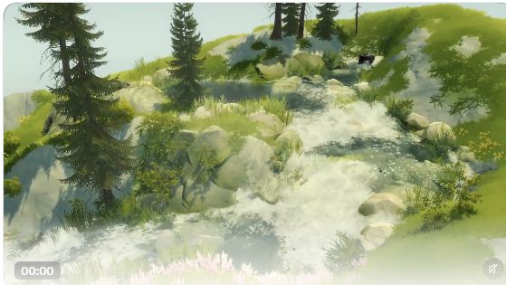
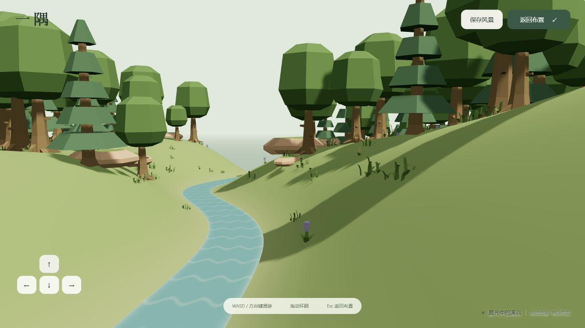

# 003 · 自然氛围与可探索造景 · 理解总览

**一个可以亲手布置、走进去、保存并继续修改的小型自然空间。** 本项目以 Protopop 的 Cozy Country 为参考，研究柔和自然氛围如何与造景、探索结合，并制作原创 Three.js 原型「一隅」。当前交付首轮研究与功能底座，视觉提升及元素扩充保留为后续计划。

[](assets/07-understanding-overview.png)

点击引导图可查看大图。它依据原作者画面与本项目实际截图生成排版；画面对照经过合成，实际运行证据见[编辑截图](assets/03-prototype-editor.jpg)、[探索截图](assets/04-prototype-explore.jpg)与[验证报告](verification.md)。[图像制作与来源记录](assets/07-understanding-overview.md)

[打开可交互原型](demo/index.html) · [查看扩展计划](expansion-plan.md) · [目标与验收](objectives.md) · [实现方式](implementation.md) · [过程记录](notes.md)

## 能力、原理与使用价值

**能力：** 以 Cozy Country 为参考研究造景与探索；原创 Three.js 原型「一隅」已连接树草花布置、擦除撤销、泉眼重排、进入漫游、环境切换和保存恢复。研究网页关联目标、过程、实现、验证及扩展计划。

**原理：** Three.js 提供场景、相机、材质与浏览器渲染；自然氛围由美术资产、配色、光影、水流和构图共同形成。一隅采用高度场、实例化植被、参数曲线河流与共同生成的河谷，流水 Shader 表现动态，世界数据支持编辑、探索和恢复。

**使用场景：** 个人自然空间、轻度造景与休闲探索，以及团队评审和技术验证；绘画、故事布景、拍照与分享是后续候选用途。

**价值：** 将观赏连接到亲手创造、进入成果和继续修改；保留原作与原型对照、可试玩底座和验收依据。扩展先验证林间溪流的整体效果，再规划八组 37 个可选条目、六种组合笔刷与三个场景模板。

**边界：** 功能底座已交付，视觉尚未达到参考效果；37／6／3 扩展均未实现，当前暂停深入开发。未试玩或复现原游戏，也未确认其算法；一隅没有积水、水量守恒、声音或植被风。16 项自动检查及核心浏览器流程通过；真实设备性能、下载落盘和用户回访仍待验证。

**研究判断：这个方向值得验证的核心，是让人用简单操作改变自然世界，并能走进自己的成果。柔和的自然氛围负责吸引与陪伴，编辑反馈、探索和保存共同构成产品体验。** 这是基于公开资料提出的产品判断，尚未经过用户测试或商业验证。

[返回总索引](../../README.md) · [研究记录](notes.md) · [产品与竞品](product-research.md) · [视觉效果](visual-analysis.md) · [技术研究](technical-research.md) · [目标与验收](objectives.md) · [实现记录](implementation.md) · [原型验证计划](prototype-plan.md) · [扩展计划](expansion-plan.md) · [验证报告](verification.md) · [证据清单](sources.json)

本项目已实现原创的 Three.js 自然空间原型「一隅」，把简单造景、进入探索和保存恢复接成一条体验。Cozy Country 提供研究参考；本原型使用独立代码、原创界面和 Kenney CC0 自然素材。实际检查及尚未覆盖的条件见 [验证报告](verification.md)。

当前版本主要验证交互底座，画面尚未达到用户期望的自然感。用户在 2026-10-06 明确“第一效果可靠，第二元素够用”；下一轮先制作林间小溪视觉样板，再扩展统一素材与组合笔刷。[扩展计划](expansion-plan.md)记录顺序、元素范围、实现方式和验收门槛，方案尚未实施。

在线入口为[理解导览](https://yydshly.github.io/1004_codex_project/demos/003-cozy-nature-worlds/research/README.html)、[可交互原型](https://yydshly.github.io/1004_codex_project/demos/003-cozy-nature-worlds/)与[扩展计划](https://yydshly.github.io/1004_codex_project/demos/003-cozy-nature-worlds/research/expansion-plan.html)。演示顶部“扩展计划”单独打开阅读页，关联目标、过程、实现、验证与研究文档。网页正文由本项目 Markdown 生成，计划、已有实现与实际验证分别保留各自状态。

| 项目 | 记录 |
| --- | --- |
| 固定编号与目录 | `003` · `003-cozy-nature-worlds` |
| 研究日期 | 2026-10-05，Asia/Shanghai |
| 原型收尾日期 | 2026-10-06，Asia/Shanghai |
| 主案例 | [Protopop Games](https://x.com/protopop) 的 [Cozy Country](https://store.steampowered.com/app/4690240/Cozy_Country/) |
| 功能快照 | Cozy Country 2.6，2026-10-01 官方更新说明；商店页面与作者公开帖子按研究日期核查 |
| 核心问题 | 自然氛围怎样转成可持续的交互体验；哪些效果必须实现；有什么可切入的产品方向 |
| 验证范围 | 公开资料研究、宣传演示观察、竞品比较，以及阶段 A 原型的实现与功能检查 |
| 当前阶段 | 首轮研究与阶段 A 功能底座已交付；视觉目标仍待完成，扩展方案已记录，用户实验尚未开展 |

## 从作者作品中确认了什么

Cozy Country 将景观创作与第一／第三人称探索放进同一产品。[官方商店](https://store.steampowered.com/app/4690240/Cozy_Country/)

2.6 特别加强了水源、低洼积水与地形改流之间的关系，自然系统的反馈进入了创作操作本身。[官方公告](https://steamcommunity.com/games/4690240/announcements/detail/678511227668791476)

作者说明自己会调整 Unity 商店素材以统一美术方向，并明确否认使用生成式 AI。素材来源不能证明具体引擎版本、渲染管线或河流算法。[作者问答](https://www.reddit.com/r/CozyGamers/comments/1whzx5w/cozy_country_lets_you_create_fantasy_landscapes/)

## 思路：让自然氛围变成可参与的体验

体验循环：**看到自然空间 → 做一次简单编辑 → 获得自然反馈 → 进入自己的场景漫游 → 保存并留下继续修改的地方 → 再次编辑。**

| 层次 | 对用户的价值假设 | 产品应交付什么 |
| --- | --- | --- |
| 自然氛围 | 愿意看、听、停留 | 连贯的光照、植被、水流、空间层次与声音 |
| 自由创造 | 能表达自己的偏好 | 少量易理解的笔刷、自动补细节、撤销与保存 |
| 沉浸探索 | 对自己的成果产生归属感 | 明确的进入入口、舒适相机与能走通的小空间 |
| 再次回来 | 保留想继续修改或停留的地方 | 可恢复的世界、命名、少量风景收藏与继续编辑 |

前三个环节应让新用户很快做出喜欢的东西；后两个环节需要验证是否真的带来回访。热帖、宣传观感和竞品存在不能代替留存与付费证据。

## 效果：先验证整体，再选择技术细节



这是本轮从[作者演示](https://x.com/protopop/status/2106768374239752625)截取的真实场景，完整网页上下文见 [01-source-post.jpg](assets/01-source-post.jpg)。原作者保有画面权利；它不是本研究原型。

画面支持对配色、构图与空间层次的观察：水流贯穿场景，岩石提供尺度与落差，树木建立高度，草花连接岸边与地面。仅凭图像无法判断具体 Shader、实际帧率或交互难度。[逐项视觉分析](visual-analysis.md)

技术上分别验证“氛围是否让人愿意停留”和“操作是否产生可理解的自然响应”。技术报告比较高度场、植被实例化、曲线河流、水深传播、存档和 Unity / Three.js；复现设计均标为方案，未认定为作者源码。[技术研究](technical-research.md)

## 产品：优先验证可进入的个人风景

建议定位草案是：**一个可以亲手布置、随时进入、持续保存的小型自然空间。** 初始受众假设为轻度创作与休闲探索用户。

| 候选方向 | 优势假设 | 首轮重点 |
| --- | --- | --- |
| 自然造景游戏 | 创作结果明确，符合现有案例 | 操作反馈、作品完成感与探索循环 |
| 个人自然空间 | 快速进入，适合短时间停留 | 一小块空间是否支持自愿回访 |
| 绘画／故事场景辅助 | 输出目的具体 | 相机、导出与布局精度，需另访谈专业用户 |

[产品研究](product-research.md)比较 Wilderless、Tiny Glade、Townscaper 和 Meadow，并讨论个体用途、买断与发行路径。第一轮只验证一条完整体验循环，避免同时承担游戏、环境陪伴工具和专业编辑器的完成标准。

## 本轮原型：阶段 A

本轮交付一块小型自然空间，树、草、花笔刷、擦除与撤销，水源重新放置，创作／探索切换，本地保存／加载、JSON 导入／导出，以及三种环境预设和减少动态设置。[objectives.md](objectives.md)以 G01–G08 定义验收，[implementation.md](implementation.md)记录模块、存档和河流实现。

实际浏览器检查已覆盖植物笔刷、擦除与撤销、泉眼重排、进入漫游与返回布置、环境与减少动态、本地存档刷新恢复，以及 JSON 内容和文件的导入往返。JSON 导出支持查看、复制和发起下载；下载文件是否真正落盘仍待验证。开发者功能检查没有验证用户是否喜欢、回访或愿意付费。



阶段 A 的溪流使用参数化中心曲线与共同生成的河谷，重新放置水源会重新生成路径与地形。流水 Shader 负责外观，当前没有积水、蓄水溢流或水量守恒模拟。阶段 B 才验证地形雕刻与积水改流。

最需要通过用户观察回答：能否很快做出喜欢的东西；是否主动走进去；是否愿意再次打开。功能检查与实际浏览器结果集中写入 [verification.md](verification.md)，用户测试方案见 [prototype-plan.md](prototype-plan.md)。原型交付不会自动证明产品假设成立。

## 本地运行与检查

在子项目根目录运行：

```powershell
Set-Location F:\codex_project\1004_codex_project\projects\003-cozy-nature-worlds
npm run dev
```

然后打开 [http://127.0.0.1:8033](http://127.0.0.1:8033)。这是本地预览地址，需保持服务运行。测试命令在同一目录单独执行：

`npm run dev` 会先生成十份关联文档网页。文档修改后可在本地服务运行期间执行 `npm run build:research`，再刷新文档页；`npm run check:research` 检查派生网页与正文一致。生成网站目录前，先构建文档网页，再在总仓库执行 `python scripts/catalog.py sync`。GitHub Pages 工作流使用同一构建步骤，提交检查会拒绝过期文档页；发布过程与线上验证见[过程记录](notes.md)。

网页和原型均以静态文件发布，浏览器直接加载随项目保存的 Three.js 与模型，无需另行部署业务后端。本地保存属于当前浏览器与站点地址；本地预览中的存档不会自动迁移到线上站点，可通过 JSON 内容导出再导入。

```powershell
npm test
```

需要自定义监听地址或端口时，直接调用服务脚本，避免 Windows 上 npm 参数透传的差异：

```powershell
node dev-server.mjs --host 127.0.0.1 --port 8033
```

浏览器运行时使用项目内的 [Three.js 0.186.1](demo/vendor/three/VERSION.txt)，许可保存在 [vendor/three/LICENSE](demo/vendor/three/LICENSE)。它无需从 CDN 加载 Three.js。树、草、花与岩石使用 [Kenney Nature Kit](https://kenney.nl/assets/nature-kit)的七个 GLB；下载凭据、模型清单和 CC0 许可见 [素材记录](demo/assets/ASSET-LICENSES.md)。

最终测试数量、浏览器操作、性能观测条件和限制以 [验证报告](verification.md)为准。原型包含世界数据、存储异常和漫游规则的回归检查；本项目没有对所有设备作帧率承诺。

## 证据与边界

- **资料确认**：商店、作者问答与公告中的定位和功能。
- **视觉观察**：本轮采集的真实宣传画面。
- **研究判断／方案**：受众、体验循环、路线建议和实验门槛。
- **原型证据**：本项目代码与实际功能检查，结果记录在验证报告。
- **未验证**：原游戏实际操作、源码与性能，以及本项目的需求规模、用户回访、盈利与情绪改善效果。

本项目是商业产品案例研究，未取得或分发游戏程序、完整素材包或源码。[证据清单](sources.json)记录访问方法与每个来源的用途，[研究记录](notes.md)保留验证边界与后续事项。
