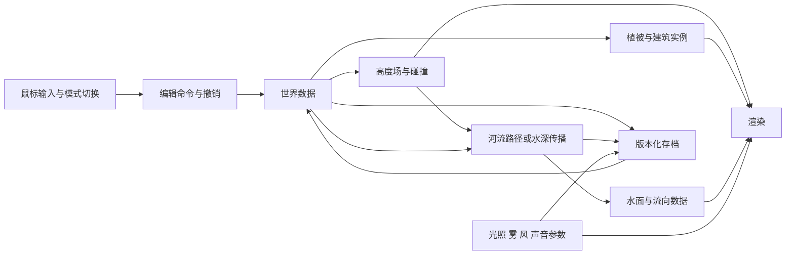

# 柔和自然世界：视觉与技术研究

研究日期：2026-10-05（Asia/Shanghai）。本报告区分公开产品行为、引擎提供的能力与本项目的实现提案；没有读取作者源码，也没有做引擎性能实测。

## 1. 证据与判断边界

| 事项 | 已确认的公开信息 | 技术判断边界 |
| --- | --- | --- |
| 创作与进入世界 | [Steam 官方商店](https://store.steampowered.com/app/4690240/Cozy_Country/)介绍散布笔刷、地形塑形、第一/第三人称探索、时间天气和拍照 | 可以分析交互闭环；具体编辑器架构未知 |
| 美术素材 | [作者本人回复](https://www.reddit.com/r/CozyGamers/comments/1whzx5w/cozy_country_lets_you_create_fantasy_landscapes/)确认使用许多 Unity 商店素材并统一美术方向 | 不能由此确定 Unity 版本、渲染管线或插件 |
| 2.6 河流 | [官方更新](https://steamcommunity.com/games/4690240/announcements/detail/678511227668791476)描述下坡、填洼、绕山、地形改变流向、编辑泉眼及保留旧河流 | 行为不等于公开算法；不能宣称作者采用浅水方程或网格水深传播 |
| 柔和氛围 | 作者说明追求平静自然体验；2.6 增加雾参数并调整镜头、角色转向 | 光照、着色和声音的具体实现仍需实机验证 |

2.6 官方正文已在项目研究过程中通过浏览器读取；本轮搜索工具直读该页失败。[SteamDB 的更新镜像](https://steamdb.info/patchnotes/25641435/)用于交叉核对文本，不作为作者技术实现的证据。

## 2. 效果怎样组成

产品效果来自统一素材、持续微动和即时创作反馈的组合。美术上先约束树形、色域、材质粗糙度与尺度，再调阳光、天空环境光和阴影；过强高光、纯黑阴影及密集植被会破坏舒缓感。这是本项目的设计判断，尚非用户测试结论。

实现提案：远处采用与天空协调的距离雾，近处保持可见度；风只轻微移动叶片和草的上部，根部固定；流水、鸟鸣、风声按距离混音，并提供独立音量。不要让所有植物同时摆动，也避免镜头快速加速。[Three.js 官方雾教程](https://threejs.org/manual/pages/fog.html)提供距离雾；[Unity 音频系统](https://docs.unity3d.com/6000.0/Documentation/Manual/Audio.html)支持空间声音与实时混音。[Unity 风区文档](https://docs.unity3d.com/6000.0/Documentation/Manual/class-WindZone.html)明确 WindZone 不作用于 Terrain 草，草须使用地形风设置或自定义 Shader。

## 3. 地形、植被与交互

地形提案使用高度场 `b(x,z)`：射线拾取鼠标落点，笔刷按中心距离衰减修改高度，提供抬高、降低、平滑与撤销。只更新受影响区块及邻接法线；高度场本身不能表达悬崖下的洞穴或悬挑。Unity 的 [SetHeights](https://docs.unity3d.com/6000.0/Documentation/ScriptReference/TerrainData.SetHeights.html)每次会重算地形 LOD 和植被，官方建议交互编辑使用延迟更新并在笔画结束同步。浏览器可用 [Raycaster](https://threejs.org/docs/pages/Raycaster.html)拾取自建地形网格。

植被散布按坡度、水深、最小间距筛选，并随机缩放和旋转。同种几何与材质合并实例绘制，再按区块裁剪、距离降低细节和密度。实例化减少绘制调用，仍需控制三角形、透明叶片重叠及阴影成本；把整个森林放进一个实例批次也会降低裁剪粒度。[Unity 实例化](https://docs.unity.com/en-us/engine/6000.0/manual/analysis/graphics-performance-profiling/reduce-draw-calls/gpuinstancing)、[Three.js InstancedMesh](https://threejs.org/docs/pages/InstancedMesh.html)和 [LOD](https://threejs.org/docs/pages/LOD.html)提供相应基础能力。

创作模式使用俯视/自由镜头和笔刷；探索模式沿用同一世界数据，启用地面碰撞与慢速移动。切换时保留视角，并将角色放在安全落点。镜头手感和切换成功率应与画质一起验收。

## 4. 河流必须拆成两个问题

**路径河流**：从泉眼寻找较低邻点，平滑成曲线，沿曲线生成带宽度的河面。它容易实现漂亮溪流，但可能停在洼地、重复访问节点或切穿曲线拐角；限步数、记录已访问节点、检查河宽与地面交叉只能处理部分问题。单独的下坡路径不能解释蓄水后溢流。

**水深传播**：若挖沟、筑坝、填洼是主要玩法，需要维护水量与水面高度。本项目可先验证以下简化算法，不声称与 Cozy Country 源码一致，也不声称完整物理模拟。

1. 用等面积网格记录地高 `b_i`、水深 `d_i ≥ 0`，水面 `s_i=b_i+d_i`；泉眼每固定步长注入体积 `Q×Δt`。
2. 对每格四邻点计算候选外流体积 `f_ij=K×Δt×max(0,s_i-s_j)`。`K` 是调节传播速率的导流系数，单位须与体积公式一致。
3. 若候选总外流大于现有体积 `A×d_i`，按比例缩小全部外流。双缓冲同时结算流入、流出，保持非负水深，避免遍历顺序影响。
4. 明确定义地图边界为排水口或封闭墙。封闭盆地持续积水，水面高过出口后向外传播；流量向量只用于视觉纹理方向。
5. 地形编辑后保留各格水体积，再让水重新分布；抬地可能暂时抬高水面，需小步推进与阻尼。低分辨率水网格可独立于渲染地形，建议先试 128²–256²，以实测决定规模。

这是基于水面差的扩散近似，缺少真实惯性、压力冲击与垂直水柱。网格会使细沟消失、流向显露四轴偏好，也可能发生振荡；大流量、陡坡和频繁雕刻需限制步长与注水量。瀑布可单独生成落差网格和粒子。不能通过每步直接截断负值掩盖守恒错误。

水的**外观**另行渲染：两层不同尺度的法线沿局部流向移动，浅处透明、深处着色，岸边依据水深/场景深度生成泡沫，落差增加白水与水花。[Three.js 官方 Water2 源码](https://github.com/mrdoob/three.js/blob/master/examples/jsm/objects/Water2.js)示范流向图、反射和折射，但不负责河道或蓄水计算；它的平面反射方式也不能直接覆盖任意起伏河面。[透明排序](https://threejs.org/manual/pages/transparency.html)可能导致水与叶片显示错误。原型优先环境反射与简化透明，实时反射留待性能允许时启用。

## 5. 提议的数据架构

存档提案保存基础场景版本、随机种子、高度差、资产 ID 与变换、泉眼位置/流量、环境参数、相机书签。若要求载入时水面完全一致，还应保存水深快照与模拟版本；仅存泉眼会重新经历填充。种子不能保证跨算法版本复现，玩家手动布置的最终变换须保存。路径河流与传播河流使用独立类型，避免升级后静默改变旧作品。

## 6. 路线与可验收原型

| 路线 | 适用目标 | 质量与成本取舍 |
| --- | --- | --- |
| Unity 桌面原生 | 较完整的自然创作游戏，长期扩充地形、角色、动物 | 地形、碰撞、音频和资源工作流较完整；仍需整合运行时编辑、统一素材与优化 |
| Three.js 浏览器 | 链接即开的概念验证、作品分享与轻量体验 | 分享方便，但编辑器、碰撞、存档和性能分档需自行搭建；需控制首屏资源、内存和植被规模 |

建议先做一张小地图、三类植被、一种水、昼夜参数、撤销、创作/漫游与保存载入。若首要验证氛围和创作意愿，路径河流即可；若首要验证改地改变水，应直接做水深试验。当前 [ShaderMaterial](https://threejs.org/docs/pages/ShaderMaterial.html)及 Water2 属 WebGL 路线；改用 WebGPU 时须选对应节点材质实现，不能假设直接兼容。

以下是验收提案，均未完成实测：

- 同一场景能刷树、塑形、撤销、切换漫游并返回；载入后手动资产变换和地形恢复。
- 水实验通过“坡面—盆地—溢流口”、筑坝、挖出口及双泉眼案例；水深不为负。无蒸发时，体积误差相对累计初始水量与注入量不超过 `10⁻⁴`，排水须计入账本。
- 在预先登记的测试设备、浏览器、1080p 与默认质量下，以帧时间中位数不超过 33.3 ms、笔刷反馈 p95 不超过 150 ms 为首轮目标；录制五分钟探索并记录内存。不能据此推断其他设备帧率。
- 邀请体验者完成五分钟创造与五分钟漫游，记录操作卡点、眩晕、声音重复及是否愿意再次停留；据此决定扩展内容还是调整体验。
