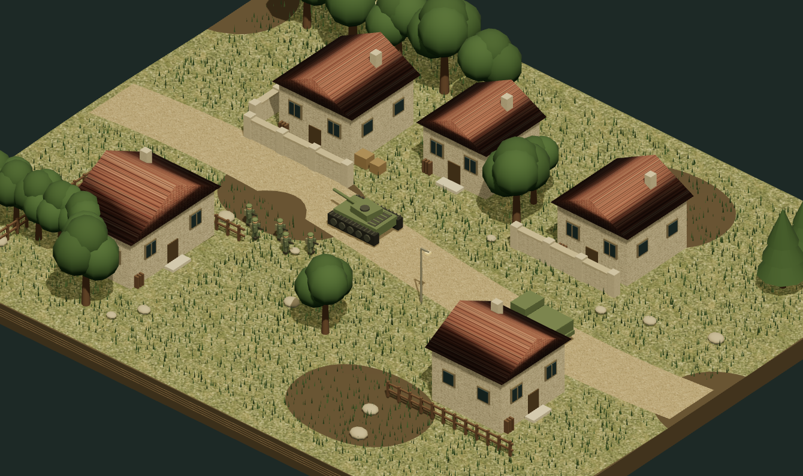
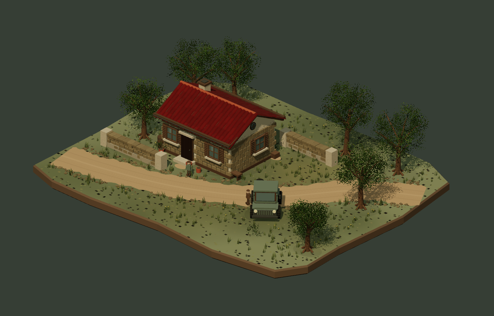

# 004 · 场景与模型风格图谱

从 Defilade 参考讨论出发，把中景构图、模型比例、自然材质与动态反馈整理成可比较、可复用的美术方案。重点是场景看起来如何、玩家会感到怎样，以及这些特征如何沉淀到后续模型；不是完整 RTS 游戏。

[返回总索引](../../README.md) · [研究笔记](notes.md) · [风格规范](style-guide.md) · [检查记录](verification.md)

## 演示内容

| 维度 | 内容 |
| --- | --- |
| 原创场景 | 乡村道路、工业院落、城镇街区 |
| 风格预设 | 自然写实、温暖微缩、荒凉废土 |
| 比较方法 | 保留同一场景的主要结构与相对尺度，再改变配色、天空与雾、光照、材质、植被和损伤表现 |
| 操作 | 镜头远近、细节等级、光照强度、暂停动态、冲击反馈、截图 |
| 概念图 | AI 生成的三联风格图，用于说明方向；它是独立概念图，不是实时渲染截图 |
| 实现 | Three.js 本地模块与原创程序几何；原生 Node.js 静态服务，无服务端依赖 |

先在一个场景里比较三个预设，再切换场景检验风格是否仍然成立。中景应能同时看懂道路、建筑群、植被和小型角色，不以单个高精度模型特写代替场景体验。

## 实际演示图



上图来自本页实时渲染，是原创简化场景，不是 Defilade 截图。另见[风格比较页面](assets/style-comparison-page.jpg)、[AI 概念图提示与生成记录](assets/image-prompt.md)和[素材及依赖说明](demo/assets/ASSET-LICENSES.md)。AI 三联概念图独立用于表达方向，不能与实际渲染图混作同一效果的证据。

## 本地运行

在本项目目录打开终端，使用 Node.js 18 或更新版本：

```powershell
cd F:\codex_project\1004_codex_project\projects\004-scene-style-atlas
npm run dev
```

打开[独立预览](http://127.0.0.1:8044/)。服务只提供 `demo/` 下的静态文件；文档保留在项目目录供阅读。未使用 `npm install`，Three.js 以本地模块提供。

需要浏览项目总目录时，使用[总目录中的 004 演示](http://127.0.0.1:8040/demos/004-scene-style-atlas/)（总目录服务端口 8040）。独立服务 8044 的“返回总目录”链接可能返回 404；从总目录进入和切换项目应使用 8040，根站点运行方法见[总索引](../../README.md)。

也可直接指定地址和端口：

```powershell
node dev-server.mjs --host 127.0.0.1 --port 8044
```

浏览器中切换场景与预设，并调整镜头、细节和光照。点击“保存画面”先打开当前实时场景的截图预览，再点击“下载 PNG”；预览可以关闭。文件名采用 `scene-atlas-场景-风格.png`。已验证预览和 PNG 数据，未用此次检查证明操作系统下载完成。实际检查结果见 [verification.md](verification.md)；本地视觉与操作检查不构成正式性能验证。

## 依据与边界

研究记录日期为 **2026-10-05，Asia/Shanghai**；参考帖日期为 **2026-10-04**。

- **官方描述**：[Steam 商店页](https://store.steampowered.com/app/5246700/)介绍了等距视角 RTS、基地和补给、士兵掩体行为与可破坏环境。记录时显示尚未发售，具体成品效果不能由宣传文字确认。
- **宣传画面观察**：[原帖](https://x.com/nexindie/status/2106723291868373127)及此前可见片段用于讨论中景、场景密度、材质与破坏的视觉感受。此处没有对原片逐帧测量。
- **设计假设**：本文给出的模型、镜头、材质和动效规则，是为当前风格探索提出的建议，不是 Defilade 官方美术规格。
- **原创简化演示**：三种场景、三种预设和冲击反馈用于比较美术方向；不宣称完全复现真实游戏美术、AI、物理破坏或正式性能表现。

未引入 Defilade 游戏模型或贴图。AI 概念图与程序场景分别标注来源；第三方库的许可应随本地模块保留。

## 第二轮实际画面



新增独立曲瓦、砌石、厚门窗与百叶、分枝和叶卡、地表色斑与成簇草地、道路轮痕及细化车辆。第二轮提供同构图“基础体块／细化样板”切换，并保留固定条件截图。实际检查见 [V2 验证记录](verification.md#v2--细化场景与留存2026-10-05)。

## 继续迭代与回顾

根据“保留已有的步骤 可以优化扩展继续 方便后期回顾”的指导，后续优化使用独立入口，保留第一轮的实现、讨论与截图。

- [迭代索引](history/README.md)：按版本查看目的、差距、制作方向与检查证据。
- [V1 原始演示](demo/versions/v1/index.html)：保留三场景、三风格的结构与风格验证；[当时的文档](history/001-structure/README.md)单独留存。
- [V2 细化样板](demo/detail-study/index.html)：在同一中景中切换“基础体块”和“细化样板”，比较建筑、材质、植被、道路和车辆细部；[本轮记录](history/002-fidelity-study.md)说明差距与验收方法。

总目录服务下可打开 [V2 本地预览](http://127.0.0.1:8040/demos/004-scene-style-atlas/detail-study/)和 [V1 保留预览](http://127.0.0.1:8040/demos/004-scene-style-atlas/versions/v1/)。V2 是提高整体美术完成度的原创程序样板，不将 AI 概念图的目标效果当作已实现结果。
