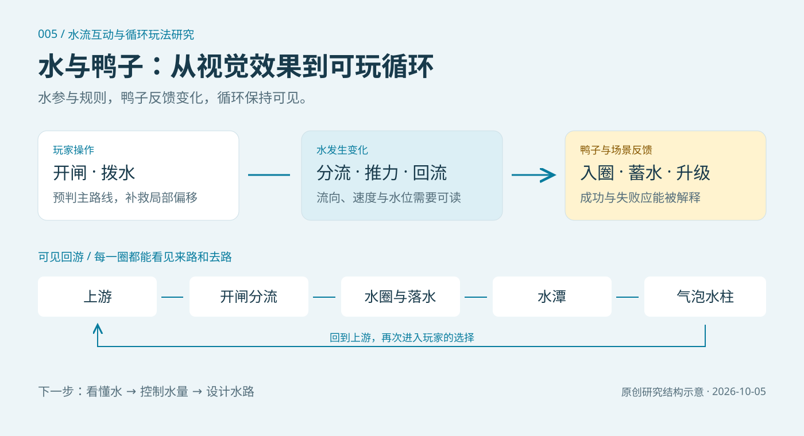

# 005 · 水流与鸭子互动 · 循环玩法研究

以 Duck 的像素瀑布视频和鸭子编辑器为参考，研究玩家改变水、鸭子反馈变化、目标与可见回程如何形成可玩循环。以九模块总览图串起来源能力、互动原理、V1–V4 原创原型、系列方向、后期复用价值和验证边界；研究页保留可试玩原型、本地记录与 JSON 导出，扩展和玩法成效继续验证。

[返回总索引](../../README.md) · [研究笔记](notes.md) · [研究来源](https://x.com/duck_wtd/status/2106807563073339790)

| 项目 | 信息 |
| --- | --- |
| 固定编号 | `005` |
| 项目目录 | `005-water-duck-loops` |
| 短名 | `water-duck-loops` |
| 研究来源 | [https://x.com/duck_wtd/status/2106807563073339790](https://x.com/duck_wtd/status/2106807563073339790) |
| 研究版本 / 资料日期 | 2026-10-05，Asia/Shanghai；保留对话中的自由玩水与循环挑战原型 |
| 参考与原创边界 | 参考视频和作者编辑器仅链接；网页中的规则、程序场景及机制图为原创实验 |

## 研究目标

- 让水的观赏性变成玩家可影响的过程，检验“水本身能不能很好玩”。
- 将闸门的路线选择、涟漪的局部推力、小鸭的轨迹与目标反馈接在一起。
- 用可见水道完成落水、游动、气泡抬升与回到上游，检验每一圈是否有新的判断。

## 摘要与结论

已观察到作者网页提供像素鸭配色编辑及 PNG / SVG 导出，可作为角色模板和配色工作流的参考；原视频提供瀑布、分层水潭、成群鸭子与循环感的视觉启发。视频是否属于游戏、是否由该编辑器制作以及原作算法尚未确认。我们的网页场景、规则与原型为原创实验，没有导入原作素材或源码。

互动原理是“玩家操作 → 水的方向、水量或节奏变化 → 鸭子轨迹、停留与输运 → 目标反馈 → 可见回程 → 下一次决策”。水同时承担操作媒介、路径、有限资源和视觉反馈；鸭子让这些规则变成可以观察和解释的行动。V1–V3 以速度场、路线约束和局部涟漪推力近似运动，V4 以分仓水量、门槛和状态转换近似输运；画面应与规则一致。

当前有四个原型版本：自由玩水支持瀑布、漩涡与分流；基础挑战 V2 提供开闸、拨水入圈、蓄水升级、失败与回游；可读水流 V3 新增方向提示、分流时机、涟漪范围、具体失败解释和试玩计数；蓄水救援 V4 用有限水量、浅湾门槛与救援时间检验放水策略。它们均采用规则近似，未实现完整流体模拟。

V4 的总水量为 120，初始上池 24、下池 96，上池容量为 60。玩家可以立即少量放水 24，或蓄到 48 后集中放水；达到选定水量自动关闸，也可提前关闸。浅湾至少有 12 水才输运鸭子，关闸后湾内余水仍有效。目标是在 45 秒内将六只鸭送入安全池，每只鸭本轮只计一次；截止后停止操作与输运，已救鸭和水继续完成回程后结算，鸭子回到上游安全区后等待新一轮。水经可见管道回到上池，溢流绕过浅湾返回下池，不产生救援收益。前 5 秒首救奖励 30 分，2.5 秒内接续救援加 5 分，救齐后还有余时奖励；这些规则分别鼓励及时首救与成批连救。具体输运速度和奖励仍是可调整的实验参数，尚未证明策略平衡。

当前原型证明了规则可以连接起来；尚未证明新手能顺利理解操作、不同规则能产生多种解法，或循环值得长期重复。网页将可确认的运行结果与待验证的玩法假设分别展示。

扩展优先级是“看懂水 → 控制水量 → 设计水路”：实验 A 已有 V3 可读性原型，实验 B 已有 V4 蓄水与溢流原型，提示是否改善操作、两种放水策略是否都有效仍待实际试玩。实验 C–F 的搭水路、不同鸭子、跨滞留区连锁救援和瀑布花园均待实现；V4 在单个浅湾的批量救援不代表完整连锁版本已完成。

## 系列方向与后期价值

这一方向可以作为系列游戏的研究基础：引流挑战检验预判与补救，蓄水救援检验资源与时机，搭水路检验设计与试错；不同鸭子的重量、惯性与群体行为，跨区域连锁救援和花园扩建可继续增加规划层次。系列应共享水与鸭子的因果关系、视觉语言与可见回程，同时让各玩法产生不同的决策。现有四版是逐步验证的研究原型，尚未构成四款完整游戏。

后期可逐步抽取水流、水量、鸭子状态、操作与目标反馈模块，积累角色配色、场景素材、关卡参数、失败解释和验证记录，减少新原型的重复制作；当前没有完成通用工具包。可试玩网页和总览图也可用于团队讨论、方案评审、教学展示及实验沟通。轻度解谜、休闲救援、搭建经营和互动展示是候选应用；应先验证玩家预测、补救、策略选择和主动重玩，再判断受众、内容成本、平台性能与产品收益。

## 图片与演示


[高清 PNG](assets/water-duck-series-map-v1.png) · [可编辑 SVG](assets/water-duck-series-map-v1.svg) · [准确文字源](assets/water-duck-series-map-v1.content.json)。九个模块与中央因果循环汇总当前理解，并区分观察、实现、待验证与未知。SVG 的来源链接可点击；研究网页也可展开总图。

本图采用原生矢量与精确排版绘制。可用 `python projects/005-water-duck-loops/scripts/build-series-map.py` 从内容 JSON 重建 SVG / PNG（需要 Pillow 与 Microsoft YaHei 字体），然后运行目录同步。旧的机制封面保留在下方。



上图是原创研究结构示意，不是原视频截图或真实流体计算结果。

[在线研究网页](https://yydshly.github.io/1004_codex_project/demos/005-water-duck-loops/) · [试玩 V4 蓄水救援](https://yydshly.github.io/1004_codex_project/demos/005-water-duck-loops/prototypes/reservoir/) · [试玩 V3 可读水流](https://yydshly.github.io/1004_codex_project/demos/005-water-duck-loops/prototypes/readable/) · [试玩 V2 引流挑战](https://yydshly.github.io/1004_codex_project/demos/005-water-duck-loops/prototypes/loop/) · [试玩 V1 自由玩水](https://yydshly.github.io/1004_codex_project/demos/005-water-duck-loops/prototypes/lab/)

[研究网页源码](demo/index.html) · [V4 源码](demo/prototypes/reservoir/index.html) · [V3 源码](demo/prototypes/readable/index.html) · [V2 源码](demo/prototypes/loop/index.html) · [V1 源码](demo/prototypes/lab/index.html) · [验证记录](verification.md)

网页汇总研究问题、三条玩法方向、原型演进、可见循环、六个扩展实验及证据边界。V4 默认展示，前三版本可切换体验并按需加载。挑战在切换原型、离开原型区域或隐藏浏览器页面时自动暂停。V2 / V3 保存当前浏览器进度；V4 本轮在内存中运行，刷新后从初始状态开始。实验记录另行存入当前浏览器，不包含服务端同步。

实验记录表保存假设、条件、顺序、操作前预测、次数、观察解释和下一步。V4 可标记小量多次、集中放水或其他策略，在观察中记录首救时间、等待时长、放水量、溢流与救援；没有显示或测量的数值写明未知。记录区分实际试玩与程序检查，支持 JSON 导出、撤回与恢复；每页显示 20 条，导出包含所有条目，撤回不删除原记录。旧记录、字段名和版本 1 导出结构继续保留：`hits` 在 V4 表示救援次数，`nudges` 表示放水次数，V2 / V3 仍表示入圈与拨水。它用于积累案例，不能自行证明可玩性。记录不会上传或跨设备同步。

新版首次读取会复制已有记录至独立的 `water-duck-research-trials-v2` 存储区，原存储不改写，防止旧页面覆盖新增 V4 条目。已打开的旧研究页应刷新后再记录；旧页此后新增的记录不会自动合并到新版。V4 没有独立的失误计数，可留空，把未救数量写入观察。

[V3 程序检查归档](experiment-records/2026-10-05-v3-program-check.json)：四次入圈、60 分、零失误，进入第二轮；仅验证规则运行，不代表新手试玩。

[V4 浏览器记录导出](experiment-records/2026-10-05-v4-trial-export.json)保留 V3 旧案例与新增 V4 案例。浏览器自动操作中，24 格六次约 1.2 秒首救、24.7 秒救齐、131 分；48 格两次约 8.7 秒首救、17.5 秒救齐、135 分。两次均完成六鸭回游，程序轮询与帧率会影响小数时间。这说明两种节奏可以运行，不能证明奖励已平衡或玩家会喜欢。

[V4 模型检查归档](experiment-records/2026-10-05-v4-model-check.json)：13 项功能检查，覆盖水量守恒、阈值、两种策略、溢流、暂停、回程结算与首救奖励边界。固定时间步的首救约为 0.88 / 8.40 秒，和浏览器案例的轮询条件不同。

## 复现方法

在仓库根目录执行，无额外第三方依赖：

```powershell
python projects/005-water-duck-loops/scripts/prepare-prototypes.py
python scripts/catalog.py sync
python scripts/catalog.py check
node projects/005-water-duck-loops/experiments/reservoir-check.cjs
node projects/005-water-duck-loops/experiments/journal-check.cjs
python -m http.server 8055 --directory site
```

打开 `http://127.0.0.1:8055/demos/005-water-duck-loops/`，默认试玩 V4：开始后选择少量或集中放水，也可提前关闸，观察浅湾水量、鸭子停留与回流。切到 V2 / V3 时按亮圈提示开左右闸，点鸭子旁边的水面，或用“拨水”按钮调整位置；方向键控制闸门，A/D 控制拨水（先聚焦原型中的控件）。V2 / V3 集满四滴水升级，三次失误结束挑战。

`prototype-sources/` 保留对话中的两份原始片段；V3 的可编辑源在 `experiments/loop-readable.fragment.html`，V4 在 `experiments/reservoir-rescue.fragment.html` 与 `experiments/reservoir-core.js`。`prepare-prototypes.py` 为普通浏览器添加本机状态保存、嵌入高度通知与自动暂停，生成可静态发布的 `demo/prototypes/`，V4 输出在 `demo/prototypes/reservoir/`。V3 保留基础挑战规则，V4 单独检验水量与时机。修改研究页使用 `demo/index.html`、`styles.css`、`app.js` 与 `journal.js`；`site/demos/` 由总索引工具同步，勿直接编辑。

## 参考与许可

- [Duck 的原帖](https://x.com/duck_wtd/status/2106807563073339790)：像素鸭子瀑布参考，帖子未给出游戏名或试玩入口。
- [作者主页](https://x.com/duck_wtd)与[鸭子编辑器](https://ducklings-maker.web.app/)：编辑器与瀑布视频的关系未确认。
- 本项目没有引入参考作品的视频、图片、源码或模型，不将原创挑战描述为对参考游戏的复现。
