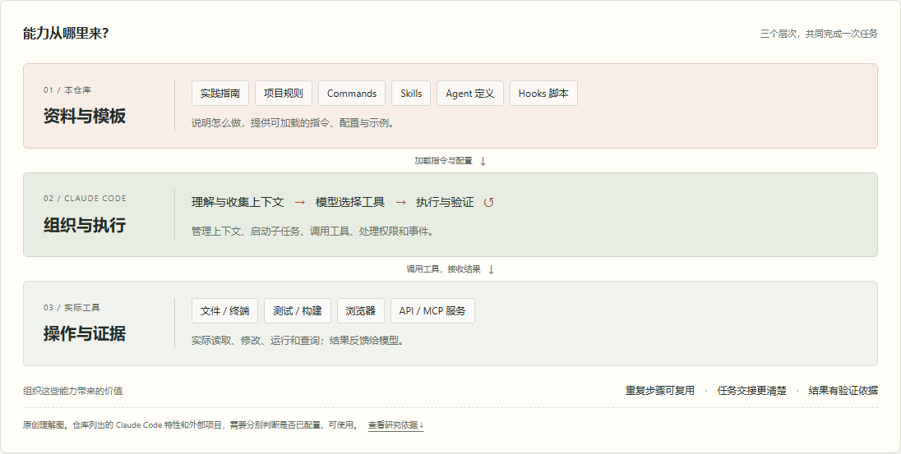

# 006 · Claude Code Best Practice · 能力与工作流研究

这个仓库提供 Claude Code 的社区学习资料、配置模板与工作流参考实现。可以借鉴项目记忆、Commands / Skills、Subagents、Hooks 与 MCP 的组织方式，把重复提示、审查步骤和复杂开发任务沉淀成可复用流程；模型推理、代码读写和实际工具执行由 Claude Code 与外部服务提供。

适用于代码研究与审查、复杂功能开发、团队交接、资料维护和外部工具接入。意义是保存项目知识、减少重复说明与遗漏、明确任务交接和验收依据；实际收益需要与适配、维护、模型和协调成本一起比较。

[返回总索引](../../README.md) · [详细研究笔记](notes.md) · [在线研究网页](https://yydshly.github.io/1004_codex_project/demos/006-claude-code-best-practice/) · [上游仓库](https://github.com/shanraisshan/claude-code-best-practice)

## 完整模块总图

[在线放大查看总图](https://yydshly.github.io/1004_codex_project/demos/006-claude-code-best-practice/module-map.html) · [PNG 原图](assets/module-map.png) · [SVG 矢量图](assets/module-map.svg)

总图覆盖固定版本 README 的 Concepts 与 Hot 全部 **47 项功能**，并加入仓库自带示例与资料导航，共 **8 组、63 个条目**。每项说明技术机制与使用方式，按官方能力、本库示例、外部生态和参考资料标注来源。矢量图中的模块可点击查看依据，网页支持分组定位和缩放。


内容数据在 [`assets/module-map.json`](assets/module-map.json)，覆盖记录在 [`assets/module-map-coverage.json`](assets/module-map-coverage.json)；[`scripts/build_module_map.py`](scripts/build_module_map.py) 可重新生成 SVG。PNG 为浏览器从同一矢量图渲染的 4400 × 3800 图片。技术总图是原创研究整理，没有替代各功能的当前官方文档或实测记录。

### 八组模块与使用入口

| 模块组 | 总图包含的模块 | 怎样使用 |
| --- | --- | --- |
| A · 知识与上下文 | Memory、Skills、Commands、Context Window、Best Practices、Prompt Library、AI Terms | 用项目规则保存约定，按需加载技能，控制上下文并查阅提示与术语 |
| B · 执行与协作 | Subagents、Workflows、Dynamic Workflows、Agent Teams、Agent View、Cross-Session Messaging、Tasks、Git Worktrees | 按任务拆分研究与实施，用工作项和独立工作树组织交接及修改 |
| C · 配置、权限与扩展 | Settings、Auto Mode、Hooks、MCP Servers、Plugins、CLI Startup Flags、Devcontainers、Agent SDK | 配置权限和启动参数，接入事件程序、外部工具与统一开发环境 |
| D · 会话体验 | Sessions、Checkpointing、Status Line、No Flicker Mode、Voice Dictation、Fast Mode、Advisor、Power-ups | 恢复会话、回退修改、观察状态，选择输入、响应与咨询方式 |
| E · 审查与持续工作 | Code Review、Bundled Skills、Ultrareview、Goal、Ralph Wiggum Loop、Scheduled Tasks、Routines | 按目标组织审查、迭代、定时与事件工作，核对完成条件和执行证据 |
| F · 外部系统 | Chrome、Computer Use、Claude Code Web、Remote Control、Channels、Slack、GitHub Actions、Artifacts、Deep Links | 把浏览器、远程会话和协作平台接入任务，按环境核对授权与可用性 |
| G · 本库参考实现 | 天气编排、PKT 时间技能、时间团队、RPI、资料维护、演示与浏览器技能、跨模型与配置样例 | 从实际文件读清入口、角色、工具调用和输出，再按自己的项目改造 |
| H · 资料与生态导航 | 研究报告、技巧、课程、外部工作流框架、Skills / Agents 集合、跨模型桥接、更新历史、演示与价值判断 | 根据问题查找原始资料，判断哪些是本库示例、官方能力或外部项目 |

A–F 对齐固定版本 README 的全部 47 项功能主题；G–H 汇总参考实现和资料目录。总图逐项标明技术细节、用法和来源，原生功能、外部插件与服务仍受版本、账号、平台和配置影响。

| 项目 | 信息 |
| --- | --- |
| 固定编号 | `006` |
| 项目目录 | `006-claude-code-best-practice` |
| 固定研究版本 | [`870f39e36b6aaf63a31edc0bfdb5f20ef14c4d82`](https://github.com/shanraisshan/claude-code-best-practice/tree/870f39e36b6aaf63a31edc0bfdb5f20ef14c4d82) |
| 核查日期 | 2026-10-05 |
| 上游许可 | [MIT](https://github.com/shanraisshan/claude-code-best-practice/blob/870f39e36b6aaf63a31edc0bfdb5f20ef14c4d82/LICENSE) · Copyright (c) 2025-2026 Shayan Rais |
| 本地交付 | 中文研究文档、静态交互网页、原创理解汇总图与页面截图 |

## 研究结论：区分三个层次

本项目回答仓库的能力、使用场景、底层原理与工程价值，重点核查天气编排、RPI、Hooks、MCP 配置和跨模型教程。

| 层次 | 提供什么 | 典型内容 |
| --- | --- | --- |
| 仓库资料与模板 | 约定、角色提示、工作流与示例配置 | `CLAUDE.md`、Commands、Skills、Agents、RPI 文档、Hook 脚本 |
| Claude Code 运行时 | 模型调用、上下文管理、工具执行、权限检查与子任务调度 | Agent loop、文件与终端工具、Skill/Agent 工具、生命周期事件 |
| 外部工具与服务 | 实际数据、网页交互和外部系统能力 | Open-Meteo、Playwright、Context7、DeepWiki、项目构建测试工具 |

复制配置能够复用流程，但运行仍需要模型、工具、依赖与权限。Markdown 不会训练新模型；“架构师”“审查员”等角色是任务提示和配置。[仓库定位](https://github.com/shanraisshan/claude-code-best-practice/blob/870f39e36b6aaf63a31edc0bfdb5f20ef14c4d82/CLAUDE.md) · [官方运行架构](https://code.claude.com/docs/en/how-claude-code-works)

## 能力与适用场景

| 能力 | 场景 | 可借鉴的内容 |
| --- | --- | --- |
| 固化项目知识 | 新成员上手、重复纠正规范 | `CLAUDE.md` 与目录规则 |
| 保存重复流程 | 多次执行审查、研究、生成任务 | Commands 与 Skills |
| 拆分子任务 | 大量检索、并行研究、不同视角的审查 | Subagents 与独立上下文 |
| 结构化开发 | 复杂功能、多角色参与、分阶段验收 | RPI：Research → Plan → Implement |
| 获取外部证据 | 文档、浏览器或实时数据 | MCP 配置、天气获取示例 |
| 观察长任务 | 完成、失败或等待输入时提醒 | Hook 声音通知与事件日志 |
| 增加审查视角 | 用另一种模型核对计划与实现 | 跨模型的计划 → 审查 → 实施 → 验证教程 |

它适合学习 Claude Code 扩展机制、建立团队共同约定、把重复提示整理成工作流。完整 RPI 有文档与验收成本，短小修复可以只取必要规则或技能。[RPI 示例](https://github.com/shanraisshan/claude-code-best-practice/blob/870f39e36b6aaf63a31edc0bfdb5f20ef14c4d82/development-workflows/rpi/rpi-workflow.md)

## 底层原理与关键边界

Claude Code 的核心循环是收集上下文 → 行动 → 验证 → 根据反馈继续。模型选择下一步，运行时执行工具并把结果交回模型。仓库把扩展放到这个循环的不同位置。[官方架构](https://code.claude.com/docs/en/how-claude-code-works)

- `CLAUDE.md` 提供持久项目说明，减少重复解释。
- Skills 默认先提供描述，使用时加载完整内容；子代理 `skills:` 中列出的技能在启动时预加载。
- Subagents 在独立上下文中完成任务并回传结果；上下文独立不等于文件系统隔离。
- Hooks 按生命周期事件触发程序；本库现有脚本主要播放通知、记录日志。
- MCP 接入外部工具与数据，Skill 可说明怎样使用它们。[机制比较](https://code.claude.com/docs/en/features-overview)

“MUST”“non-negotiable” 是文字流程要求。硬性限制需要运行时识别的工具权限、规则、沙箱或阻断 Hook。声音 Hook 始终成功退出，不是安全拦截器。天气 Agent 使用 `allowedTools` 字段，而当前官方子代理文档使用 `tools` / `disallowedTools`；因此本研究不把工具隔离描述为已经实测成立。[项目指令](https://code.claude.com/docs/en/memory) · [子代理配置](https://code.claude.com/docs/en/sub-agents)

## 固定版本的天气流程

```text
/weather-orchestrator
  → 询问摄氏度 / 华氏度
  → Agent(weather-agent)
      → Skill(weather-fetcher)
          → WebFetch(Open-Meteo API)
      ← 数字温度 + 单位
  → Skill(weather-svg-creator)
      → weather.svg + output.md
```

Agent 的 `skills:` 预加载了获取说明，当前正文仍明确要求显式 `Skill(weather-fetcher)`；不能省略成“Agent 直接抓 API”。图卡 Skill 在获取温度后调用并读取参考模板，失败时停止的要求也写在提示中。[入口](https://github.com/shanraisshan/claude-code-best-practice/blob/870f39e36b6aaf63a31edc0bfdb5f20ef14c4d82/.claude/commands/weather-orchestrator.md) · [天气 Agent](https://github.com/shanraisshan/claude-code-best-practice/blob/870f39e36b6aaf63a31edc0bfdb5f20ef14c4d82/.claude/agents/weather-agent.md)

## 网页与复现方法

网页源码是 [`demo/index.html`](demo/index.html)，站点同步产物位于 [`site/demos/006-claude-code-best-practice/`](../../site/demos/006-claude-code-best-practice/)。交互用于解释分层、上下文和流程，不调用 Claude、MCP 或天气 API。

在工作区根目录运行：

```powershell
python -m http.server 8766 --bind 127.0.0.1 --directory .
```

打开 [本地演示](http://127.0.0.1:8766/site/demos/006-claude-code-best-practice/)。静态页预览不需要 Claude 账号、API 密钥或 Node.js。

总索引封面和网页首张引导图采用 [`assets/module-map.png`](assets/module-map.png) 完整模块总图。下方 [`assets/overview.png`](assets/overview.png) 补充解释三层能力关系；[`assets/page-desktop.png`](assets/page-desktop.png) 与 [`assets/page-mobile.png`](assets/page-mobile.png) 记录本地研究页，不是上游工作流运行截图。



网页包括六种能力机制、五步执行循环、六步天气编排、四种场景与价值判断，以及固定版本的源码入口。新增四步“请求 → 上下文 → 工具 → 反馈”说明、六类需求的机制选用器、机制对照表、输入输出契约、价值验证方法与常见问题。

“选用与实践”提供 [变更审查示例包](demo/assets/starter/review-starter.zip)：项目约定示例、显式调用的 `review-change` Skill、交付检查清单和使用说明。ZIP 内已按建议路径放置 Skill；单文件也能下载。它们是本页原创学习模板，需按实际项目补齐，没有在 Claude Code 中执行验证。

迁移提示对照当前官方文档说明 Commands 与 Skills 合并、`allowed-tools` 的免确认授权语义，以及异步 Hook 的边界。全部切换、推荐跳转、文件下载、键盘操作和桌面至手机五种宽度（1440、1024、768、390、360 像素）的浏览器检查通过，无脚本错误与横向溢出；ZIP 的四个条目与源文件逐一一致。总索引入口、封面加载和返回跳转也通过。

补充页面截图：[选用指南 · 桌面](assets/practice-desktop.png) · [选用指南 · 手机](assets/practice-mobile.png)。

## 验证范围与许可

本次核查固定提交的源码、配置和文档，并对照官方机制。没有执行上游天气、RPI、跨模型工作流或音频 Hook；没有把旧示例产物当成当前版本成功运行的证据。实际复现的前置条件与验收项见 [notes.md](notes.md)。

上游为 MIT 许可。若复制代码或实质性内容，应保留 Copyright (c) 2025-2026 Shayan Rais 与完整 MIT 许可。上游外链的第三方资料、服务和素材须分别核查授权；本研究不改变其许可。
