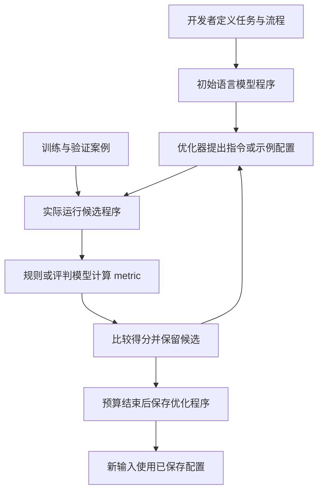

# 009 · DSPy 原理算法与评分机制研究

**DSPy 是构建、评估和优化语言模型程序的 Python 框架。** 我们讨论的优化主线可以概括为：提出候选程序配置，让模型在案例上实际运行，用指定指标评分，再保留或继续修改较好的配置。候选配置主要是指令和示例组合；普通提示优化不更新模型权重。评分标准由开发者或外部评判器提供，DSPy 不会凭空知道什么结果是正确的。

[返回总索引](../../README.md) · [在线研究网页](https://yydshly.github.io/1004_codex_project/demos/009-dspy/) · [网页源码](demo/index.html) · [算法与源码笔记](notes.md) · [评分机制](scoring.md) · [仿真应用与扩展](applications.md) · [整理与验证记录](verification.md) · [官方仓库](https://github.com/stanfordnlp/dspy)


上图是本研究使用内置 imagegen 制作的概念总览，不包含实测性能数据。[查看原图](assets/dspy-overview.png) · [完整生成提示](assets/image-prompt.txt)。网页可以放大或下载原图，按优化对象筛选算法，并切换代码生成与巡检日志两个例子。

本项目保存这次讨论形成的理解，并纠正“只是评价质量”“只生成样例”“自动自训练求解”的过度概括。已整理官方资料与源码，**尚未安装 DSPy、调用模型或完成优化实验**。

## 完整摘要

**能力：** DSPy 是构建、评估和优化语言模型程序的 Python 框架，可声明结构化输入输出、组合模型与工具调用、记录轨迹并保存优化配置；具体生成与推理能力来自接入的模型。

**原理：** Signature 定义任务，Module 组织流程，Adapter 组装请求；在案例上执行候选，以规则、参考答案、执行检验或评判模型提供的 metric 评分。算法能力包括 Bootstrap 筛选轨迹为示例、BootstrapRS 随机搜索示例组合、MIPROv2 用 Optuna TPE 联合搜索指令与示例、COPRO 逐模块改进指令、SIMBA 小批次归纳规则与示例、GEPA 利用反馈反思演化；微调和实验性 GRPO 连接外部训练后端。

**使用场景：** 可重复且可评价的分类、抽取、摘要、检索问答、代码生成、数学与规则推理、工具流程及日志报告；不要求每次输入海量资料，可扩展领域评分、数据工具适配和多模块优化。

**价值：** 对你的无人机仿真，适合作为离线日志分析、异常提取与带证据报告的辅助层；对研究库，可复用资料整理与引用核验流程。主要收益是减少人工调提示、组合示例、跑测试和维护配置的重复工作，是否采用要与直接调用模型比较。

**边界：** 物理模拟、传感器建模、状态估计和实时控制需专门算法；单次任务或稳定提示可能无需 DSPy。普通提示优化不改模型权重，高分不保证真实正确，收益需覆盖数据、调用与维护成本。本研究为资料与源码整理，尚未做 DSPy 模型实测。


| 项目 | 信息 |
| --- | --- |
| 固定编号与目录 | 009 / `projects/009-dspy` |
| 整理日期 | 2026-10-08，Asia/Shanghai |
| 研究快照 | [a7e7edb8c6803d88aeb25c6a0412657c01835bc5](https://github.com/stanfordnlp/dspy/tree/a7e7edb8c6803d88aeb25c6a0412657c01835bc5)，提交时间 2026-10-07 21:17:38 UTC |
| 版本依据 | 快照的 [pyproject.toml](https://github.com/stanfordnlp/dspy/blob/a7e7edb8c6803d88aeb25c6a0412657c01835bc5/pyproject.toml) 标注 3.4.0；不是本机安装版本或最新发行验证 |
| 上游许可 | [MIT](https://github.com/stanfordnlp/dspy/blob/a7e7edb8c6803d88aeb25c6a0412657c01835bc5/LICENSE)；模型、数据和训练服务的条件另行核对 |
| 当前状态 | 研究中；理解与源码映射已整理，效果和成本有待实验 |
| 网页交付 | 11 节中文导览、14 个优化相关类、两个完整例子、个人价值判断与验证路线 |
| 网页源与构建 | `web/` + `build-research.mjs`；静态产物放在 `demo/`，由目录工具复制到 `site/` |

## 从我们的提问得到的结论

| 我们的提问或概括 | 更准确的理解 |
| --- | --- |
| 是一个评价质量的库吗 | 评估只是一个子系统；还负责定义任务、组合模型调用，以及优化程序配置 |
| 底层原理是什么 | 用 Signature 定义输入输出，Module 组织流程，Adapter 转成模型请求，外部模型生成，metric 评价，Optimizer 搜索可调配置 |
| 是重复生成样例再择优吗 | 这描述了部分算法；更一般的是生成和评价候选配置。输入案例、提示里的示例、模型输出、候选程序不是同一对象 |
| 是筛选优秀结果后自训练吗 | Bootstrap 可以筛选轨迹作为提示示例；只有进入微调或强化学习路径，才涉及模型权重训练 |
| 算法主要在哪个模块 | 优化算法主要在 `dspy/teleprompt/`，任务执行在 `dspy/predict/`，评估在 `dspy/evaluate/`；具体优化器各有算法 |
| 分数由谁判断 | 指定的 metric：规则、参考答案、可执行检验、业务结果，或另一个语言模型。优化器使用这些分数进行选择 |
| 能否求解任意仿真场景 | 可以接入特定语言模型分析环节；物理模拟、数值估计、实时控制和策略学习仍需各自的算法与环境 |
| 最佳场景是检索同类信息吗 | 检索和抽取只是应用之一；输入可以很短，代码生成、推理和工具调用也可以优化 |
| 它的价值有限吗 | 对单次任务、稳定提示和纯数值求解，通常没有必要。重复使用、多模块、可评价的模型流程更值得实验比较 |

依据：[任务与模块](https://dspy.ai/current/diving-deeper/modules/) · [优化器源码入口](https://github.com/stanfordnlp/dspy/blob/a7e7edb8c6803d88aeb25c6a0412657c01835bc5/dspy/teleprompt/__init__.py) · [评估源码](https://github.com/stanfordnlp/dspy/blob/a7e7edb8c6803d88aeb25c6a0412657c01835bc5/dspy/evaluate/evaluate.py)。

## 用一个普通任务理解整个过程

假设要把客服工单分成“账户、订单、其他”三类。我们先定义输入文本和输出标签，再准备已标注工单，并把“标签正确得 1 分，否则 0 分”作为指标。

初始程序可能只有一条简单指令。优化器可以提出更清楚的分类指令、挑选更有帮助的提示示例，或者组合两者；每次都在案例上实际调用模型，以平均得分选择候选。优化结束后保存程序，新的工单使用保存的指令和示例进行预测。新工单一般不需要重新执行整套优化搜索；KNNFewShot 等方法另有运行时处理。



这张图描述普通提示优化。模型权重在该过程保持不变；BootstrapFinetune 等训练路径另见[算法笔记](notes.md)。

## 能力与底层分工

| 部分 | 具体职责 | 关键实现 |
| --- | --- | --- |
| Signature | 声明输入、输出、类型和任务说明 | `dspy/signatures/signature.py` |
| Module 与 Predict | 用 Python 组合任务，发起模型调用并记录执行轨迹 | `dspy/primitives/module.py`、`dspy/predict/predict.py` |
| Adapter 与 LM | 把字段、指令和示例装成请求，调用外部模型并解析结果 | `dspy/adapters/`、`dspy/clients/` |
| metric 与 Evaluate | 逐例计算质量分数，汇总比较程序效果 | `dspy/evaluate/` 与开发者提供的函数 |
| Optimizer | 修改候选配置，组织搜索和选择 | `dspy/teleprompt/` 中的具体类 |
| 可选训练后端 | 根据轨迹数据训练模型，并返回新的模型引用 | `BootstrapFinetune` 或实验性 RL 接口连接的 provider |

`ChainOfThought` 等模块提供调用结构，具体生成能力来自所接入的模型。`compile()` 在这里表示优化并返回可复用的程序配置。[Predict](https://github.com/stanfordnlp/dspy/blob/a7e7edb8c6803d88aeb25c6a0412657c01835bc5/dspy/predict/predict.py) · [Adapter](https://dspy.ai/current/diving-deeper/adapters/) · [ChainOfThought](https://github.com/stanfordnlp/dspy/blob/a7e7edb8c6803d88aeb25c6a0412657c01835bc5/dspy/predict/chain_of_thought.py)。

## 我们关注的几种算法

| 算法 | 主要改动什么 | 选择依据或机制 |
| --- | --- | --- |
| BootstrapFewShot | 提示中的成功执行示例 | 教师运行案例，metric 通过后提取模块轨迹 |
| BootstrapRS | 不同示例组合 | 随机改变案例顺序和示例数量，比较验证分数 |
| MIPROv2 | 指令和示例组合 | 模型提出候选，Optuna 的 TPE 搜索离散组合 |
| COPRO | 指令与输出前缀 | 逐模块提出候选并评价整个程序，反复改进 |
| SIMBA | 指令规则或示例 | 小批次多次运行，利用好坏轨迹差异提出修改 |
| GEPA | 指令；Flex 路径还可涉及代码 | 反思轨迹与反馈，演化候选，验证和可选合并 |
| BootstrapFinetune | 模型权重 | 收集轨迹为训练数据，通过后端进行微调 |

完整 14 个优化相关类、实验性 GRPO 以及算法与外部依赖的对应关系，见[算法与源码笔记](notes.md)。各类并不都采用“生成候选、评分择优”：LabeledFewShot、KNNFewShot、Ensemble 有不同机制。

## 评分决定了优化方向

若 100 个工单中有 80 个标签正确，逐例平均为 0.8，`Evaluate` 的汇总显示为 80。这是说明计算方式的例子，不是本项目实测。

对于开放文本，可以使用参考答案匹配、语义评判、证据支持度或可执行检验；不同指标测量不同属性。语言模型给的高分可能有误，来源支持度也不能保证来源本身正确。优化器能找到更符合指标的配置，指标是否代表真正目标仍需独立验证。具体公式、接口和实例见[评分机制](scoring.md)。

## 使用场景与扩展方向

适合研究的任务包括文本分类、结构化抽取、检索问答、工具调用以及仿真日志的事件提取和报告。共同条件是：能定义输入输出、能够反复运行，并能提供有意义的评价信号。

结合我们讨论的无人机与传感器仿真，当前可研究的是“仿真产生日志 → 提取事件 → 对照日志生成分析 → 检查结论证据”。DSPy 可以优化其中的语言模型模块；它自身不提供运动方程、雷达物理模型、数值控制器或通用仿真策略训练环境。本项目聚焦离线分析，自动攻击决策不在研究范围内。

可扩展方向是领域评分器、仿真日志适配、带证据的报告、多模块错误归因、优化成本控制和版本管理。建议先用一个非武器任务验证“优化后的程序能否在新案例上更好”，再考虑更复杂的流程。[应用分工与后续方案](applications.md)。

## 对你的价值与使用判断

它主要省下反复调提示、组合示例、跑实验和保存配置的工作。具体任务能力仍来自接入的模型、数据和工具；这些实验也可以自行写脚本组织。因此，需要把采用框架的收益与案例标注、metric 设计、模型调用和维护成本一起比较。

对你的无人机仿真，当前定位是离线日志和证据报告的辅助层。运动模拟、传感器建模、状态估计和控制需要专门算法。对当前研究库，还可评估重复资料抽取、统一研究报告和引用核验；如果只是一次性讨论或一条已稳定的提示，直接调用模型可能更省事。

网页提供具体任务的价值对照表，不预设 DSPy 一定提升效果。采用前保留同模型、同数据划分的直接调用基线，在新案例上验收。

## 网页构建与预览

```powershell
node projects/009-dspy/build-research.mjs
node projects/009-dspy/build-research.mjs --check
python scripts/catalog.py sync
python scripts/catalog.py check
python -m http.server 8749 --bind 127.0.0.1 --directory site
```

从仓库根目录运行后，打开 `http://127.0.0.1:8749/demos/009-dspy/`。构建器从 notes.md 提取算法卡片，复制样式、阅读交互、图片和生成提示；完整网页正文以 `web/index.html` 为源。[在线入口](https://yydshly.github.io/1004_codex_project/demos/009-dspy/)由既有 GitHub Pages 工作流发布，实际发布结果见[部署验证记录](verification.md)。

## 参考与许可

- [DSPy 论文](https://arxiv.org/abs/2310.03714)、[MIPRO 论文](https://arxiv.org/abs/2406.11695)、[GEPA 论文](https://arxiv.org/abs/2507.19457)用于理解设计背景；当前实现以固定快照为准。
- [官方优化器说明](https://dspy.ai/current/diving-deeper/choosing-an-optimizer/)和其他 `current` 文档可能继续变化，阅读时核对版本。
- 本项目是原创中文研究整理，不包含上游源码副本或模型数据；上游许可和第三方条款不因本记录改变。
